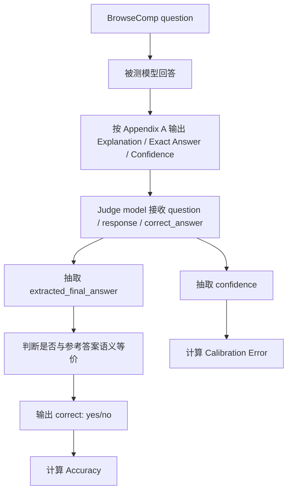
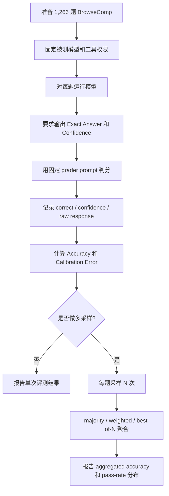

# BrowseComp 学习笔记

> 来源：`D:\Users\文献\BrowseComp-A Simple Yet Challenging.pdf`
> 论文：BrowseComp: A Simple Yet Challenging Benchmark for Browsing Agents
> 重点：测试集构造、数据质量控制、评测流程与指标

## 1. 一句话概括

BrowseComp 是一个面向联网浏览 Agent 的短答案检索基准：题目答案通常是单个短字符串，验证相对容易，但找到答案需要长时间、多路径、可回溯的网页搜索。

## 2. 核心结论

- 数据集最终包含 1,266 个问题，目标是测试“坚持搜索、策略性改写查询、跨来源拼接线索”的能力，而不是测试长文本问答或常见搜索问题。
- 题目由人工训练员构造，采用“先找事实，再反向写题”的方式，让答案容易核验但难以发现。
- 自动评测使用模型裁判判断预测答案与参考答案是否语义等价，并同时读取模型自报置信度，用于准确率和校准误差分析。
- 普通无浏览模型几乎无法解决该基准；Deep Research 取得明显更高准确率，但论文也指出其绝对置信度校准较差。
- 多次采样和基于置信度的 best-of-N 能显著提升结果，说明模型的置信度虽然不够校准，但仍能作为“候选答案排序信号”。

## 3. 论文结构速览

| 部分 | 页码 | 要点 |
|---|---:|---|
| Abstract / Introduction | 1-2 | 提出 BrowseComp，强调 hard-to-find、short-answer、easy-to-verify |
| Data collection and verification | 3-4 | 人工构造题目、难度检查、主题分布、自动判分方式 |
| Human performance | 5 | 人类训练员答题实验，量化题目难度 |
| Evaluation of models | 6-8 | 模型准确率、校准误差、测试时计算量、多采样聚合、pass rate 分布 |
| Related work and discussion | 8-9 | 与既有检索/问答基准的区别与局限 |
| Appendix A/B | 11 | 模型回答格式和 grader prompt |

## 4. 测试集情况

### 4.1 数据规模与形态

| 项目 | 信息 |
|---|---|
| 最终题量 | 1,266 |
| 原始题量 | 1,287 |
| 移除题量 | 21 |
| 答案形式 | 单个、短、可核验字符串 |
| 题目来源 | 人工训练员创建 |
| 目标能力 | 联网搜索、事实判断、搜索路径调整、跨网页线索整合 |

被移除的 21 题来自后续审查：论文称在 Deep Research 0% pass rate 的题目中发现部分标注答案格式不匹配、题干歧义或参考答案错误，因此从数据集中删除。

### 4.2 题目构造方法

BrowseComp 的关键设计是“hard to find, easy to verify”。

构造流程可以理解为：

这种构造方式的强项是：一旦给出候选答案，几次搜索就能验证；但如果没有候选答案，搜索空间很大，暴力枚举成本高。

### 4.3 题目筛选与难度控制

论文中使用了三类难度检查：

| 检查 | 作用 |
|---|---|
| 当时模型无法解出 | 要求训练员验证 GPT-4o、GPT-4o with browsing、OpenAI o1、早期 Deep Research 等不能解出 |
| 简单搜索不能直接找到 | 训练员做 5 次简单 Google 搜索，确认答案不在第一页结果中直接出现 |
| 人类 10 分钟内难以解出 | 部分问题由第二名训练员尝试；若某训练员题目被解出比例超过 40%，需要修订 |

这里的“10 分钟”主要是构造阶段的难度约束；后面的人类性能实验允许最长约 2 小时搜索。

### 4.4 唯一答案风险

BrowseComp 的反向构造会带来一个内在风险：作者能确认参考答案正确，但很难穷尽所有可能答案来证明唯一性。

论文采取的缓解方式：

- 训练员需要对领域足够熟悉，确信不存在其他有效答案。
- 如果不够确信，需要增加更多约束条件。
- 如果第二名训练员在 10 分钟内找到另一个有效答案，题目会被反馈给原训练员修订。

这意味着 BrowseComp 更像“高置信度单答案基准”，而不是严格数学意义上的唯一解数据集。

### 4.5 主题分布

| 主题 | 数量 | 占比 |
|---|---:|---:|
| TV shows & movies | 205 | 16.2% |
| Other | 197 | 15.6% |
| Science & technology | 173 | 13.7% |
| Art | 127 | 10.0% |
| History | 125 | 9.9% |
| Sports | 123 | 9.7% |
| Music | 116 | 9.2% |
| Video games | 71 | 5.6% |
| Geography | 70 | 5.5% |
| Politics | 59 | 4.7% |

主题标签是后验分类的，由 prompted ChatGPT model 标注。这个分布说明数据集并不只覆盖学术或百科事实，而是大量包含娱乐、艺术、体育、音乐等开放网页信息。

### 4.6 数据泄漏控制

论文明确要求不要在线公开数据集示例问题或答案，并加入 canary string 以便从训练语料中识别和过滤该基准。笔记中也不复写论文表 1 的具体题目和答案。

## 5. 人类表现：测试集难度校准

论文让创建题目的同一批训练员参与答题，但不能回答自己创建的问题，也不能使用 ChatGPT、Claude、Perplexity、Grok、Gemini 等 AI 助手。

| 项目 | 结果 |
|---|---:|
| 实际参与人类实验的问题数 | 1,255 |
| 因各种原因未尝试的问题数 | 11 |
| 人类 2 小时后放弃 | 888 / 1,255 = 70.8% |
| 人类解出 | 367 / 1,255 = 29.2% |
| 解出题中与参考答案一致 | 317 / 367 = 86.4% |

解释：

- 2 小时上限远高于构造阶段的 10 分钟检查，但人类仍只解出 29.2%，说明题目确实很难。
- 解出题中只有 86.4% 与参考答案一致，提示数据集中仍可能存在题干歧义、替代答案或人类误判。
- 作者也承认参与者不是“竞赛级网络搜索者”，侦探、调查记者等专业搜索者可能表现更好。

## 6. 评测方法流程

### 6.1 单次模型评测流程

模型被要求输出三个字段：

| 字段 | 作用 |
|---|---|
| Explanation | 给出推理或搜索说明 |
| Exact Answer | 简短最终答案，是判分核心 |
| Confidence | 0%-100% 置信度，用于校准分析 |

判分 prompt 的核心原则是：只比较 extracted final answer 与 correct answer 是否匹配，不重新解题，不讨论背景，不替换成其他答案。

### 6.2 自动判分

由于参考答案都是短字符串，论文使用 AI grader 判断预测答案与参考答案是否语义等价。

Grader 输出包括：

| 输出 | 含义 |
|---|---|
| extracted_final_answer | 从模型回复中抽取最终答案；没有则为 None |
| reasoning | 只解释预测答案与参考答案是否匹配 |
| correct | yes/no |
| confidence | 从模型回答中抽取置信度；若没有置信度则按 prompt 规则填 100 |

需要注意：论文没有给出校准误差的具体公式，因此复现实验时应查 simple-evals 代码或明确实现版本。

### 6.3 指标

| 指标 | 解释 | 论文用途 |
|---|---|---|
| Accuracy | correct=yes 的比例 | 衡量短答案任务完成率 |
| Calibration Error | 模型置信度与实际正确率的偏差 | 衡量模型是否知道自己可能错 |
| Pass rate per task | 同一题多次运行中答对比例 | 分析题目难度分布 |
| Aggregated accuracy | 多样本聚合后的最终准确率 | 衡量更多测试时计算量能否换来更好答案 |

## 7. 模型结果

| 模型 | Accuracy | Calibration Error |
|---|---:|---:|
| GPT-4o | 0.6% | 69% |
| GPT-4o w/ browsing | 1.9% | 82% |
| GPT-4.5 | 0.9% | 68% |
| OpenAI o1 | 9.9% | 65% |
| Deep Research | 51.5% | 91% |

主要解读：

- 只给 GPT-4o 增加普通 browsing，准确率从 0.6% 到 1.9%，提升有限；说明“能联网”本身不等于“能持续有效搜索”。
- OpenAI o1 没有浏览能力但达到 9.9%，说明部分答案可能来自内部知识和推理。
- Deep Research 显著更高，说明 BrowseComp 特别奖励持久浏览、检索策略调整和多来源综合。
- Deep Research 的 calibration error 也最高，说明其错误时可能仍较自信。论文脚注还提示 Deep Research 接触过专门训练其擅长 BrowseComp 任务的数据，这对解读结果是一个重要 caveat。

## 8. 测试时计算量与多采样评测

### 8.1 单次尝试中的 browsing effort

论文图 1 展示：改变 Deep Research 的 browsing effort 后，准确率随测试时计算量平滑上升。这里每个点是一整轮完整评测，而不是单题示例。

关键含义：BrowseComp 对 test-time compute 敏感，适合观察 Agent 是否能用更多搜索、更多回溯和更长推理换来更高准确率。

### 8.2 64 次采样聚合

论文进一步对每个问题生成 64 个输出，每个输出都包含模型自报置信度，然后比较三种聚合策略：

| 聚合策略 | 方法 |
|---|---|
| Majority voting | 选择出现频率最高的答案 |
| Weighted voting | 按模型自报置信度加权投票 |
| Best-of-N | 选择置信度最高的单个答案 |

结果要点：

- 三种方法都比单次尝试提高约 15%-25%。
- Best-of-N 最稳定、最高。
- 虽然模型置信度不是校准概率，但可以作为同一题多个候选答案之间的相对排序信号。

## 9. Pass Rate 分布与题目复核

论文用每题 64 次 trial 来分析题目难度分布。

| 分析 | 结论 |
|---|---|
| Deep Research | 约 16% 题目 100% pass rate，约 14% 题目 0% pass rate |
| OpenAI o1 | 图中显示大量题目集中在 0% pass rate，反映其在该基准上整体较弱 |
| 0-pass 题目复核 | 对 Deep Research 从未答对的题，给出 ground-truth answer 后要求找网页证据；多数可以找到证据 |

这个复核很关键：它区分了“题目不可解”和“模型没有找到入口”。多数 0-pass 题在给定答案后能找到证据，说明问题主要是搜索策略和发现难度，而不是答案不存在。

一个需要复核的细节：论文正文同时出现“Deep Research 0% pass rate 约 14%”和“审查 118 个 0-pass 任务”的表述，按 1,266 题计算二者比例不完全一致。严谨复现时应以发布数据和评测脚本为准。

## 10. 评测流程复现清单

复现时建议额外记录：

- 模型版本、日期、reasoning effort、浏览工具版本和搜索预算。
- 是否允许并行浏览、最长运行时间、最大 tool calls 或 browsing effort。
- Grader 模型版本和 prompt。
- 每题 raw response、抽取出的 final answer、judge reasoning、confidence。
- 所有被判错但看似等价的答案，单独人工抽查。

## 11. 局限与注意点

- BrowseComp 不代表真实用户查询分布；它不评测长答案生成、开放式歧义处理或用户交互澄清。
- 题目主要是文本网页事实检索，不覆盖图片、视频、音频、交互式网页等多模态信息查找。
- 反向构造题可能存在替代有效答案，虽然论文有人工修订流程，但不能形式化保证唯一答案。
- 自动 grader 会引入判分模型误差，尤其在别名、缩写、格式差异、数值容差和多语言答案上需要抽查。
- 公开示例会造成数据泄漏，使用时应避免把题目和答案放入训练语料或公开日志。

## 12. 个人复习清单

- [ ] BrowseComp 为什么“容易验证但难以找到”？
- [ ] 构造阶段的三个难度检查分别过滤什么问题？
- [ ] 为什么 1,266 题不是原始 1,287 题？
- [ ] 人类 2 小时实验说明了哪些难度特征？
- [ ] Grader 只应该判断什么，不应该做什么？
- [ ] Accuracy、Calibration Error、Pass rate per task 分别回答什么问题？
- [ ] 为什么 best-of-N 会比 majority voting 更适合 BrowseComp？
- [ ] BrowseComp 作为 Agent benchmark 的主要局限是什么？
