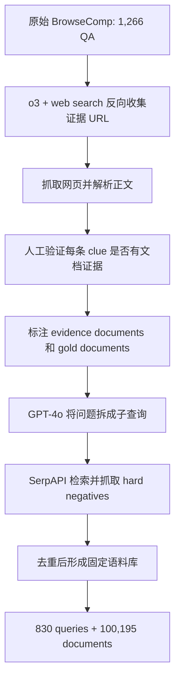
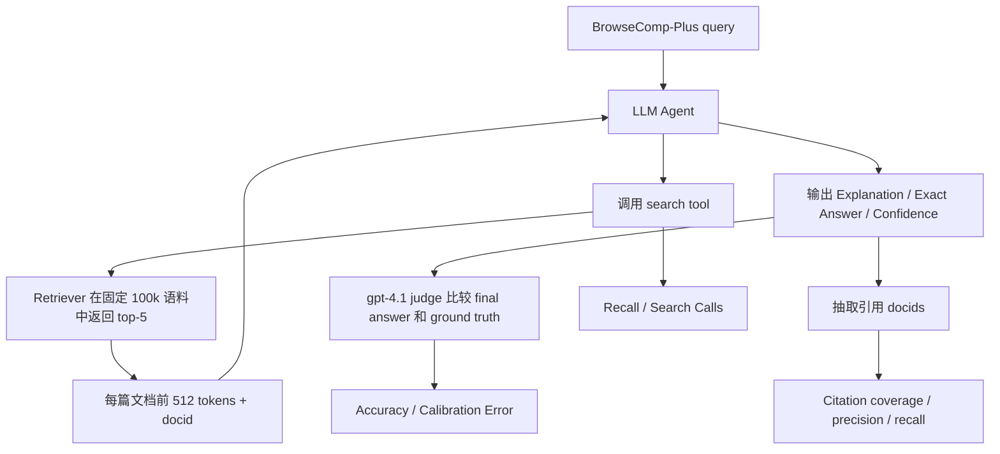

# BrowseComp-Plus 学习笔记

> 来源：`D:\Users\VScode\Search_agent\Testset_bangdan\BrowseComp-Plus\repo\BrowseCompPlus_paper.pdf`
> 论文：BrowseComp-Plus: A More Fair and Transparent Evaluation Benchmark of Deep-Research Agent
> 重点：测试集构造、固定语料库、评测流程、检索器与 Agent 解耦评测

## 1. 一句话概括

BrowseComp-Plus 从原始 BrowseComp 出发，为每个保留问题构建固定、人工验证的证据文档和 hard negatives，使 Deep-Research Agent 的评测从黑盒动态网页搜索变成可复现、可拆解的“LLM Agent + Retriever + 固定语料库”实验。

## 2. 核心结论

- 原 BrowseComp 只提供问题和答案，通常依赖 live web search API；这会带来不可复现、工具不透明、难以区分 LLM 与检索器贡献的问题。
- BrowseComp-Plus 最终包含 830 个查询和 100,195 篇固定文档，每题平均 6.1 篇 evidence documents、76.28 篇 negatives、2.9 篇 gold documents。
- 数据构造分为证据文档收集、人工验证、hard negative mining 三个核心环节。
- 评测分两层：端到端 Deep-Research Agent 评测，以及独立 Retriever 评测。
- 更强检索器不仅提高答案准确率，还能减少搜索调用次数；gpt-5 + Qwen3-Embedding-8B 达到 70.12% accuracy。
- Oracle retrieval 下 gpt-4.1 可达到 93.49%，说明大量失败来自检索与工具使用，而不是语料本身缺证据。

## 3. 为什么需要 BrowseComp-Plus

原始 BrowseComp 的优点是问题难、答案短、适合评估深度网页搜索能力；但它有两个关键缺陷：

| 问题 | 影响 |
|---|---|
| 动态 web search API 黑盒 | 不同时间、不同搜索服务、不同排序策略会导致结果不可复现 |
| 没有固定文档语料和 qrels | 无法独立评测 retriever，也难以判断错误来自检索、阅读还是推理 |

BrowseComp-Plus 的核心改造是给 BrowseComp 问题补上固定语料库和人工相关性标注，让评测类似 TREC/Cranfield 范式：同一批 query、同一批 documents、同一批 relevance labels。

## 4. 测试集构造流程

### 4.1 总体流程

### 4.2 设计目标

构造固定语料库时，论文强调三个要求：

| 要求 | 含义 |
|---|---|
| Comprehensive coverage | 文档必须覆盖回答问题所需的完整推理链 |
| Retrieval difficulty | 语料中要有足够干扰文档，使检索不是简单匹配 |
| Practical size | 语料要足够大以支持研究，但不能大到实验成本失控 |

## 5. Evidence Document 收集

原始 BrowseComp 没有提供支持答案的网页 URL。BrowseComp-Plus 使用 OpenAI o3 with web search 做反向证据挖掘：

- 输入：原始 question-answer pair。
- 任务：搜索能支持正确答案的网页。
- 输出表格包含三列：clue、URL、evidence。
- 目的：把复杂题目拆成多个可验证线索，方便人工标注。

数量变化：

| 阶段 | 数量 | 说明 |
|---|---:|---|
| 原始 BrowseComp QA | 1,266 | 起点 |
| o3 未能提供证据 | 124 | 格式错误或低置信度拒答等 |
| 有 o3 证据 URL 的 QA | 1,142 | 进入网页抓取 |
| 因 URL 无法完整抓取而排除 | 137 | 任一 clue 缺 URL 都会导致题目证据链不完整 |
| 进入人工验证 | 1,005 | 证据候选集 |

网页抓取使用 Selenium，正文解析使用 Trafilatura。

## 6. 人工验证与 Gold Document 标注

人工验证目标不是简单看 URL 是否相关，而是检查证据是否足以让人完整回答问题。

标注者需要做两件事：

- 对每个 clue，确认是否有支持文档，并在文档中标出 supporting text span。
- 判断所有 clue 与文档组合起来是否足以回答整个问题。

如果 o3 给出的证据不够，标注者需要修订 clue 并继续搜索至少 20 分钟；仍无法补齐证据时才判定失败。

Gold document 的定义也更严格：不是简单包含答案字符串，而是“逻辑上包含最终答案”。例如答案可能是计数、日期变体、同义表达或隐式信息，因此 gold document 需要人工语义判断。

质量控制：

- 14 名大学生标注者参与。
- 总人工工作量超过 400 小时。
- 对每名标注者的数据抽样交叉验证，平均一致率超过 80%。
- 1,005 个候选中，830 个通过人工验证。

未通过的常见原因包括：

- o3 给出的文档无法满足 clue 证据要求，人工也无法在合理时间内补齐。
- 原 BrowseComp 中存在题目或答案缺陷。
- 部分题目依赖 Google Maps 距离类交互能力，不适合静态文档语料库。
- 题目存在歧义或多个有效答案。

## 7. Hard Negative Mining

为了让固定语料库有足够检索难度，论文为每个问题挖掘 hard negatives。

流程：

子查询 prompt 要求：

- 每个子查询聚焦一个信息点。
- 子查询必须自包含，不能用代词或“this person”等上下文依赖表达。
- 保留原问题的重要约束。
- 返回 JSON array。

## 8. 最终语料统计

| 项目 | 数值 |
|---|---:|
| Queries | 830 |
| Documents | 100,195 |
| 平均 evidence documents / query | 6.1 |
| 平均 hard negatives / query | 76.28 |
| 平均 gold documents / query | 2.9 |
| 平均 document words | 5,179.2 |
| 平均 document characters | 32,296.2 |

检索工具默认只返回每篇文档前 512 tokens。论文检查后发现，在这种截断下，86.5% 的 query 至少有一个 gold document 的前 512 tokens 包含 ground-truth answer。

这说明 512-token preview 虽然有信息损失，但大部分题仍可通过 preview 找到答案；后文也用 `get-document` 工具做了全文读取消融。

## 9. 评测对象

### 9.1 LLM Search Agents

论文评测了商业模型和开源模型：

| 类别 | 模型 |
|---|---|
| 商业 / 闭源 | o3、gpt-4.1、gpt-5、Claude Opus 4、Claude Sonnet 4、Gemini 2.5 Pro、Gemini 2.5 Flash |
| 开源 / 开放权重 | Qwen3-32B、Search-R1-32B、gpt-oss-20B、gpt-oss-120B |

所有模型基本使用同一 tool-use prompt；例外是 Search-R1 使用与其训练对齐的 prompt。

### 9.2 Retrievers

| Retriever | 类型 | 说明 |
|---|---|---|
| BM25 | 稀疏词法检索 | Pyserini 提供 |
| Qwen3-Embedding-0.6B/4B/8B | 稠密向量检索 | Tevatron 提供 |
| ReasonIR-8B | 推理密集型稠密检索 | 针对 reasoning-intensive retrieval 训练 |

默认 search tool 每次返回 top-k=5，每条结果只给前 512 tokens。

## 10. 端到端 Agent 评测流程

主搜索 prompt 要求模型：

- 逐步使用 search tool。
- 可以多次调用 search。
- 最终输出 `Explanation`、`Exact Answer`、`Confidence`。
- 在 Explanation 中用方括号引用 evidence documents 的 docid。

## 11. 端到端评测指标

| 指标 | 含义 |
|---|---|
| Accuracy | gpt-4.1 judge 判断最终答案是否匹配 ground truth |
| Recall | Agent 在整个交互过程中检索到了多少人工验证 evidence documents |
| Search Calls | 每个 query 平均调用 search API 的次数 |
| Calibration Error | 模型自报 confidence 与实际正确率的偏差 |

Accuracy 使用与 BrowseComp 类似的 LLM-as-judge prompt。judge 只判断 extracted final answer 是否与 correct answer 匹配，不重新解题。

Calibration Error 论文沿用 BrowseComp / Humanity’s Last Exam 的做法；Search-R1 因输出格式没有 confidence source，不报告该指标。

## 12. Retriever 独立评测流程

BrowseComp-Plus 的一个关键贡献是可以在 Cranfield/TREC 范式下独立评测 retriever。

输入：

- 固定 query set。
- 固定 100,195 documents。
- 人工标注的 evidence documents qrels。
- 人工标注的 gold documents qrels。

计算：

- Evidence Document Retrieval：检索支持推理链的文档。
- Gold Document Retrieval：检索直接或逻辑上包含最终答案的文档。
- 指标：Recall@5、Recall@100、Recall@1000、nDCG@10。

标准解释：

$$
Recall@k = \frac{|\text{relevant documents in top-k}|}{|\text{all relevant documents}|}
$$

nDCG@k 衡量相关文档是否排在更靠前位置，越高说明排序质量越好。

## 13. Citation 评测

因为 prompt 要求模型在最终解释中引用 docid，论文还统计 citation quality：

| 指标 | 含义 |
|---|---|
| Coverage | 输出中是否包含引用，或每题引用覆盖情况 |
| Avg # Citations | 平均引用文档数 |
| Precision | 引用中有多少是 evidence documents |
| Recall | 人工 evidence documents 中有多少被引用 |

Search-R1 被排除在 citation 表之外，因为其 fine-tuned 输出不包含 citations。

## 14. 主要结果

### 14.1 End-to-end Agent Accuracy

| LLM | Retriever | Accuracy | Recall | Search Calls | Calibration Error |
|---|---|---:|---:|---:|---:|
| gpt-4.1 | BM25 | 14.58% | 16.42% | 10.35 | 68.96% |
| gpt-4.1 | Qwen3-Embed-8B | 35.42% | 36.89% | 8.67 | 54.67% |
| o3 | BM25 | 49.28% | 56.64% | 25.93 | 12.58% |
| o3 | Qwen3-Embed-8B | 63.49% | 73.24% | 23.97 | 16.77% |
| gpt-5 | BM25 | 55.90% | 61.70% | 23.23 | 13.50% |
| gpt-5 | Qwen3-Embed-8B | 70.12% | 78.98% | 21.74 | 9.11% |
| Sonnet 4 | Qwen3-Embed-8B | 36.75% | 47.33% | 9.03 | 24.51% |
| Opus 4 | Qwen3-Embed-8B | 36.14% | 50.84% | 10.24 | 12.79% |
| Gemini 2.5 Pro | Qwen3-Embed-8B | 28.67% | 35.31% | 6.04 | 44.08% |
| gpt-oss-120B-high | Qwen3-Embed-8B | 42.89% | 52.63% | 18.35 | 40.34% |
| Qwen3-32B | Qwen3-Embed-8B | 10.36% | 7.80% | 0.94 | 59.84% |
| SearchR1-32B | Qwen3-Embed-8B | 10.36% | 10.17% | 1.69 | N/A |

解读：

- gpt-5 + Qwen3-Embedding-8B 最强，达到 70.12%。
- 同一个 LLM 换更强 retriever，准确率通常显著提升，且 search calls 往往下降。
- 闭源强推理模型调用 search 更多，通常超过 20 次；Qwen3-32B 和 SearchR1-32B 即使被要求用工具，平均调用也少于 2 次。
- 开源模型的主要短板不是“看到证据后不会答”，而是 interleaved reasoning + tool use 能力弱。

### 14.2 Retriever 独立结果

| Retriever | Evidence Recall@5 | Evidence Recall@100 | Evidence nDCG@10 | Gold Recall@5 | Gold Recall@100 | Gold nDCG@10 |
|---|---:|---:|---:|---:|---:|---:|
| BM25 | 1.2 | 4.7 | 1.6 | 1.4 | 6.1 | 1.7 |
| Qwen3-Embed-0.6B | 6.2 | 26.5 | 8.0 | 8.5 | 30.5 | 7.4 |
| Qwen3-Embed-4B | 9.8 | 40.2 | 14.0 | 13.0 | 47.3 | 13.6 |
| Qwen3-Embed-8B | 14.5 | 47.7 | 20.3 | 18.5 | 55.8 | 19.5 |
| ReasonIR-8B | 12.2 | 43.6 | 16.8 | 15.3 | 49.7 | 15.5 |

Qwen3-Embedding 系列呈现明显 size scaling，8B 最强；BM25 在这类复杂 BrowseComp 查询上非常弱。

## 15. 关键消融

### 15.1 Oracle Retrieval

Oracle 设置：直接把所有人工标注 positive documents 提供给 Agent。

结果：

- gpt-4.1 达到 93.49%。
- Qwen3-32B 达到 83.25%。
- 对 gpt-4.1 剩余 6.51% 错误，人工复核确认答案确实可由 positive documents 回答，错误来自模型推理失败。
- Qwen3-32B 的部分错误来自 positive documents 超出上下文窗口。

这说明 BrowseComp-Plus 语料本身证据覆盖较好，真实瓶颈主要在检索、上下文选择、工具调用和推理。

### 15.2 Reasoning Effort

gpt-oss 系列支持 low/medium/high reasoning effort。论文发现：

- 更高 reasoning effort 提升 accuracy 和 recall。
- 代价是 search calls 大幅增加。
- calibration error 通常下降，说明更充分推理让置信度和正确性更一致。

示例：

| Model | Retriever | Low Accuracy | High Accuracy | Low Search Calls | High Search Calls |
|---|---|---:|---:|---:|---:|
| oss-20B | Qwen3-Embed-8B | 13.37% | 34.58% | 1.87 | 23.87 |
| oss-120B | Qwen3-Embed-8B | 24.94% | 42.89% | 2.21 | 18.35 |

### 15.3 Get-Document Tool

默认 search 只返回每篇文档前 512 tokens。论文额外加入全文读取工具 `get-document`。

| Model | Accuracy | Search Calls | Get Document Calls | Calibration Error |
|---|---:|---:|---:|---:|
| gpt-4.1 | 35.42% | 8.67 | N/A | 54.67% |
| gpt-4.1 + get-doc | 43.61% | 10.03 | 1.85 | 54.28% |
| Qwen3-32B | 10.36% | 0.94 | N/A | 59.84% |
| Qwen3-32B + get-doc | 11.69% | 1.01 | 0.27 | 56.47% |

全文读取工具对 gpt-4.1 帮助明显，但对 Qwen3-32B 帮助有限，因为它较少主动使用该工具。

### 15.4 Corpus Size

论文把原 100k 语料扩展到加入 FineWeb 10BT 后的 9,771,311 文档，测试结论是否变化。

结果：

- BM25 的检索分数提升，可能因为大语料改善 IDF 估计。
- 神经检索器的 measured retrieval scores 下降，因为新增未标注文档可能排进 top ranks，并在 TREC 评测里被视作 non-relevant。
- 端到端答案准确率没有因大语料显著改善；Qwen3-32B + Qwen3-Embed-8B 从 10.36% 降到 7.11%。

结论：原 100k 语料已经有足够正例覆盖和干扰难度，能支持稳健比较。

## 16. 与 BrowseComp / BrowseComp-ZH 的关键差异

| 维度 | BrowseComp / ZH | BrowseComp-Plus |
|---|---|---|
| 评测环境 | 依赖 live web/API 或产品搜索能力 | 固定 100k 文档语料 |
| 标注内容 | 问题 + 参考答案 | 问题 + 答案 + evidence docs + gold docs + hard negatives |
| 是否能独立评测 retriever | 很难 | 可以，TREC qrels + Recall/nDCG |
| 是否可控比较工具 | 不充分 | 可以替换 retriever、top-k、doc preview、get-doc |
| 主要分析对象 | 系统总体能力 | Agent、retriever、citation、search calls、context strategy |

## 17. 复现评测清单

复现实验至少要固定：

- 830 queries 和 100,195 document corpus。
- evidence document qrels 与 gold document qrels。
- Retriever 类型、索引方式、top-k=5、文档截断长度 512 tokens。
- LLM 版本、prompt、tool schema、最大调用预算。
- 是否启用 get-document tool。
- Judge 模型版本：论文使用 gpt-4.1。
- 每题 raw response、Exact Answer、Confidence、search calls、retrieved docids、cited docids。
- Accuracy、Recall、Search Calls、Calibration Error、Citation metrics、Retriever Recall@k/nDCG@k。

## 18. 局限与注意点

- BrowseComp-Plus 保留了 BrowseComp 的复杂事实检索风格，不代表普通用户查询分布。
- 固定语料提高了复现性，但不能完全模拟真实开放网页的动态性和工具多样性。
- 默认只给文档前 512 tokens，可能低估需要阅读全文的 Agent。
- Gold document 是人工语义标注，质量较高但仍可能有主观边界。
- 加入更大外部语料后，未标注文档可能成为 false negatives，影响 TREC-style 指标解释。
- Search-R1 使用不同 prompt，且无 confidence/citation 输出，横向比较时要单独看待。

## 19. 复习清单

- [ ] BrowseComp-Plus 解决了原 BrowseComp 的哪两个评测问题？
- [ ] 从 1,266 个原始 QA 到 830 个最终 query，中间筛掉了哪些类型？
- [ ] Evidence document 和 gold document 的区别是什么？
- [ ] 为什么 hard negatives 要通过子查询 + web search 挖掘？
- [ ] 端到端 Agent 评测和 Retriever 独立评测分别回答什么问题？
- [ ] 为什么 Qwen3-Embedding-8B 能同时提高 accuracy 并减少 search calls？
- [ ] Oracle retrieval 93.49% 说明了什么？
- [ ] `get-document` 工具为什么对强模型更有用？
