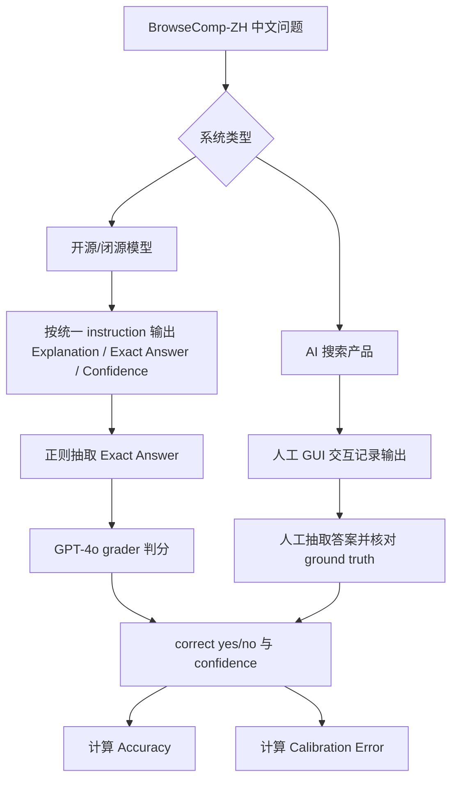

# BrowseComp-ZH 学习笔记

> 来源：`D:\Users\文献\BrowseComp-ZH-Benchmarking Web Browsing.pdf`
> 论文：BrowseComp-ZH: Benchmarking Web Browsing Ability of Large Language Models in Chinese
> 重点：中文测试集构造、质量控制、评测流程与指标

## 1. 一句话概括

BrowseComp-ZH 是面向中文互联网浏览能力的高难度短答案基准：问题在中文信息生态中原生构造，答案短且可验证，但需要多跳搜索、信息筛选和推理整合才能找到。

## 2. 核心结论

- BrowseComp-ZH 不是把英文 BrowseComp 翻译成中文，而是在中文网页、中文搜索引擎和中文表达习惯下原生构造。
- 最终数据集包含 289 题，来自 480 个初始样本，经过难度验证和唯一答案验证两轮筛选。
- 每题答案通常是日期、数字、专名等短客观事实；问题则由多个时间、空间、类别或描述性约束组合而成。
- 评测覆盖 20+ 系统，包括开源模型、闭源 API 和 AI 搜索产品；普通模型和 AI 搜索产品的答案抽取方式不同。
- 指标包括 Accuracy 和 Expected Calibration Error（ECE）；论文明确给出 5 个置信度分箱的 ECE 计算方式。

## 3. 论文结构速览

| 部分 | 页码 | 要点 |
|---|---:|---|
| Abstract / Introduction | 1-3 | 提出中文网页生态下的浏览评测缺口，说明不能直接翻译英文 benchmark |
| Related Work | 3-4 | 对比英文检索/浏览基准和中文检索数据集 |
| The BrowseComp-ZH Dataset | 4-6 | 数据构造、两阶段质量控制、主题与长度分布 |
| Benchmarks | 6-9 | 被测模型、评测设置、指标、结果与分析 |
| Appendix | 13-14 | 模型输出格式与 GPT-4o 评分 prompt |

## 4. 测试集情况

### 4.1 数据规模

| 阶段 | 数量 | 说明 |
|---|---:|---|
| 初始样本 | 480 | 由专家标注者按反向构造方式生成 |
| 移除简单样本 | 76 | 交叉验证中 10 分钟内可由搜索引擎找到答案 |
| 高难候选 | 404 | 进入唯一答案验证 |
| 移除歧义样本 | 115 | 存在替代答案或约束不唯一 |
| 最终样本 | 289 | 高难、短答案、可验证中文网页浏览任务 |

### 4.2 为什么不能直接翻译 BrowseComp

论文认为英文题翻译成中文会失真，主要原因包括：

- 中文网页的信息源结构不同，例如百度百科、知乎、政府门户、垂直站点等。
- 中文命名、简称、别名和语义省略更常见，关键词检索路径不稳定。
- 英文中的 canonical source，例如 Wikipedia、IMDb，在中文生态中未必有对应结构。
- 翻译题可能把原本复杂的约束变成显式关键词匹配，从而降低难度。

所以 BrowseComp-ZH 采用中文原生构造：问题、证据链、搜索步骤都在中文互联网环境下完成。

### 4.3 标注者与题目来源

论文招募 10 名专家贡献者，均为硕士或博士背景，并具有 LLM 使用和网页搜索经验。

构造时，标注者从 11 个预定义领域中至少选择 5 个自己熟悉或感兴趣的主题，然后先确定客观事实答案，再反向设计复杂问题。

答案需要满足两个条件：

- 可由可靠来源独立验证，不需要主观解释。
- 足够具体，避免泛化常识或过于常见的事实。

### 4.4 反向构造流程

题目设计遵循三条原则：

| 原则 | 具体做法 |
|---|---|
| 多约束设计 | 组合时间、地点、类别、描述等条件，通常至少两个维度 |
| 非平凡检索 | 在百度、Bing、Google 上分别使用 3 组关键词测试；如果首页能找到正确答案，就修订问题 |
| 证据可追踪 | 每个样本至少包含一个权威来源 URL，支持问题约束和目标答案之间的逻辑关系 |

另外，所有问题还会用 web-enabled 的 GPT-4o 和 DeepSeek 测试；如果两个模型都能轻松找到正确答案，则通过隐式约束、弱化关键词等方式增加复杂度。

### 4.5 两阶段质量控制

第一阶段：问题难度验证。

| 规则 | 说明 |
|---|---|
| 交叉验证 | 每个标注者验证其他人写的问题 |
| 工具限制 | 只允许使用搜索引擎，不使用 LLM |
| 时间限制 | 每题 10 分钟 |
| 判定低难 | 10 分钟内找到答案 |
| 判定高难 | 10 分钟内找不到答案，且题目结构逻辑清晰、可验证 |

该阶段移除 76 个简单样本，留下 404 个高难候选。

第二阶段：答案唯一性验证。

流程是 human-in-the-loop：

- 先让多个表现较好的 AI agent 对 404 个高难候选生成推理过程和答案。
- 使用的系统包括 OpenAI DeepSearch/DeepResearch、Perplexity、Doubao deep reasoning、OpenAI O1、Gemini 2.5 Pro。
- 标注者人工检查这些回答中是否存在满足所有约束的替代答案。
- 如果替代答案也满足事实准确性、具体性、可验证性，但不同于原答案，则该题被视为歧义并删除。

该阶段删除 115 个歧义样本，最终得到 289 题。

### 4.6 主题分布

| 主题 | 数量 | 占比 |
|---|---:|---:|
| Film & TV | 45 | 15.6% |
| Art | 40 | 13.8% |
| Geography | 37 | 12.8% |
| Music | 32 | 11.1% |
| History | 29 | 10.0% |
| Medicine | 26 | 9.0% |
| Video Games | 23 | 8.0% |
| Technology | 22 | 7.6% |
| Sports | 18 | 6.2% |
| Policy & Law | 10 | 3.5% |
| Academic Papers | 7 | 2.4% |

数据集中影视、艺术、地理、音乐、历史占比较高；政策法律和学术论文较少，论文认为这可能与这些领域中可稳定溯源的事实答案更难构造有关。

### 4.7 问答长度

- 问题长度主要集中在 60-90 个中文字符，说明题目短但信息密度高。
- 答案长度主要集中在 5-10 个中文字符，符合短答案、易验证的设计目标。

## 5. 评测对象

论文把被测系统分成三类：

| 类别 | 示例 | 是否浏览 |
|---|---|---|
| 开源模型 | DeepSeek-V3、DeepSeek-R1、Qwen2.5-72B、Qwen3、QwQ-32B、Llama4 | 多数不浏览 |
| 闭源模型 | GPT-4o、O1、O4-mini、Claude、Gemini、Qwen2.5-MAX | 多数不浏览 |
| AI 搜索产品 | OpenAI DeepResearch、Grok Research、Perplexity Research、Doubao、Kimi、Yuanbao、DeepSeek Search | 浏览 |

需要注意：这不是所有模型共享同一工具环境的严格控制实验。AI 搜索产品通过各自产品界面进行 GUI 交互，不同产品的检索轮数、搜索引擎、网页访问策略和后处理机制并不统一。

## 6. 评测方法流程

### 6.1 整体流程

### 6.2 模型输出格式

对开源/闭源模型，论文额外加入指令：如果问题需要外部资源，也不要拒答或让用户自行搜索，而是基于自身知识给出具体答案。

统一输出字段：

| 字段 | 作用 |
|---|---|
| Explanation | 对最终答案的解释或推理 |
| Exact Answer | 简洁最终答案，用于判分 |
| Confidence | 0%-100% 置信度，用于校准误差 |

AI 搜索产品也被要求输出相同格式，但论文指出这些产品常有产品化后训练，未必严格遵循格式，因此后续采用人工抽取。

### 6.3 自动判分与人工判分的差异

| 系统类型 | 答案抽取 | 判分方式 |
|---|---|---|
| 开源模型 | 正则表达式抽取 | GPT-4o 使用 BrowseComp 改写版 grader prompt 判定 |
| 闭源模型 | 正则表达式抽取 | GPT-4o 使用同一 grader prompt 判定 |
| AI 搜索产品 | 人工抽取 | 人工验证与 ground truth 是否一致 |

这点很重要：论文标准化了输出格式和正确性目标，但并没有完全标准化工具使用环境，也没有对 AI 搜索产品使用同一个自动 grader 流水线。

### 6.4 GPT-4o Grader 逻辑

评分 prompt 要求 judge 只做一件事：判断模型抽取出的 final answer 是否与 correct answer 匹配。

Grader 输出：

| 输出项 | 说明 |
|---|---|
| extracted_final_answer | 从 response 中抽取最终答案；没有则为 None |
| reasoning | 只解释预测答案和参考答案是否等价 |
| correct | yes/no |
| confidence | 从 response 中抽取 0%-100% 置信度；没有则填 100 |

prompt 明确要求不要重新解题、不要讨论背景、不要提出不同于参考答案的新答案。

## 7. 指标

### 7.1 Accuracy

Accuracy 是答对样本占总样本比例：

$$
Accuracy = \frac{\# correct}{N}
$$

其中 $N=289$。

### 7.2 Calibration Error / ECE

论文将预测置信度分为 5 个区间：

- $[0, 0.2)$
- $[0.2, 0.4)$
- $[0.4, 0.6)$
- $[0.6, 0.8)$
- $[0.8, 1.0]$

ECE 定义为：

$$
ECE = \sum_{i=1}^{B} \frac{n_i}{N}\left|acc(i) - conf(i)\right|
$$

其中：

- $B$：分箱数量，这里是 5。
- $n_i$：第 $i$ 个置信度分箱中的样本数。
- $N$：总样本数。
- $acc(i)$：第 $i$ 个分箱中的实际准确率。
- $conf(i)$：第 $i$ 个分箱中的平均预测置信度。

ECE 越低，说明模型自报置信度越接近真实正确率。

## 8. 主要结果

| 系统 | 类别 | Reasoning | Browsing | Accuracy | ECE |
|---|---|---|---|---:|---:|
| OpenAI DeepResearch | AI Search Product | - | Y | 42.9% | 9 |
| O1 | Closed-Source | Y | N | 29.1% | 52 |
| Gemini-2.5-Pro | Closed-Source | Y | N | 27.3% | 59 |
| Doubao Deep Search | AI Search Product | - | Y | 26.0% | 61 |
| DeepSeek-R1 | Open-Source | Y | N | 23.2% | 59 |
| Perplexity Research | AI Search Product | - | Y | 22.6% | 53 |
| Doubao Standard | AI Search Product | - | Y | 18.7% | 37 |
| Claude-3.7-Sonnet | Closed-Source | Y | N | 17.7% | 71 |
| O4-mini | Closed-Source | Y | N | 15.2% | 42 |
| Grok3 Research | AI Search Product | - | Y | 12.9% | 39 |
| Yuanbao Hunyuan | AI Search Product | - | Y | 12.2% | 56 |
| QwQ-32B | Open-Source | Y | N | 11.1% | 64 |
| DeepSeek-V3 | Open-Source | N | N | 8.7% | 72 |
| Qwen3 Thinking | Open-Source | Y | N | 13.2% | 67 |
| GPT-4o | Closed-Source | N | N | 6.2% | 73 |
| Llama4 | Open-Source | N | N | 4.8% | 70 |

结果解读：

- 最强系统是 OpenAI DeepResearch，准确率 42.9%，但仍未达到一半，说明数据集难度高。
- 具备推理能力的非浏览模型也能较好表现，例如 O1、Gemini-2.5-Pro、DeepSeek-R1 都超过 20%。
- 普通大模型即使参数规模大，通常仍低于 10%。
- 多轮检索 AI 搜索产品整体优于单轮检索产品。

## 9. Reasoning 与 Browsing 的作用

论文分别分析了推理能力和搜索产品形态。

推理能力提升：

- DeepSeek-R1 明显优于 DeepSeek-V3。
- Claude-3.7-Sonnet 明显优于 Claude-3.5-Sonnet。
- Gemini-2.5-Pro 明显优于 Gemini-2.0-Flash。
- Doubao Deep Search 优于 Doubao Standard。

浏览能力不是无条件有效：

- 多轮检索系统，如 DeepResearch、Perplexity、Doubao Deep Search，更适合这种多约束问题。
- 单轮检索系统，如 Kimi、Yuanbao、DeepSeek Search，表现较弱。
- DeepSeek-R1 在无浏览时为 23.2%，启用 DeepSeek 搜索产品后降到 7.6%。论文推测原因是检索内容与内部知识没有良好对齐，低质量外部信息反而覆盖了更可靠的内部知识。

## 10. 复现评测时的关键记录项

要复现实验，至少应记录：

- 数据集版本和 289 个样本的 ground truth。
- 被测系统版本、日期和调用入口。
- 对开源/闭源模型使用的 temperature、top-p；论文对可配置模型采用 temperature=0.6、top-p=0.95。
- 对固定参数模型，如 O1、Claude-3.7，记录其不可配置参数限制。
- AI 搜索产品的 GUI 操作流程、是否人工介入、输出保存方式。
- 答案抽取方式：正则抽取还是人工抽取。
- Grader 模型版本：论文使用 GPT-4o。
- 每题 response、Exact Answer、Confidence、correct、judge reasoning。

## 11. 与原 BrowseComp 的关键差异

| 维度 | BrowseComp | BrowseComp-ZH |
|---|---|---|
| 语言生态 | 英文网页 | 中文网页 |
| 构造方式 | 人工反向构造 | 中文原生人工反向构造 |
| 最终规模 | 1,266 | 289 |
| 搜索难度检查 | 简单 Google 搜索等 | 百度、Bing、Google，每个 3 组关键词 |
| 唯一性验证 | 人工与二次尝试 | 多 Agent 生成候选答案 + 人工验证替代答案 |
| 判分 | AI grader | 普通模型 GPT-4o grader，AI 搜索产品人工抽取验证 |
| 明确 ECE 公式 | 原文未展开公式 | 给出 5-bin ECE 公式 |

## 12. 局限

- 数据集规模较小，只有 289 题；主题多样性和问题类型仍可扩展。
- 唯一答案无法完全保证，尤其中文网页动态变化会导致事实更新、页面失效或答案冲突。
- AI 搜索产品的工具环境不统一，GUI 人工交互也可能引入复现差异。
- 对 AI 搜索产品采用人工抽取和验证，与普通模型的 GPT-4o 自动判分流程不同，横向比较时需注意。
- 数据集中包含较多影视、艺术、地理等领域，政策法律和学术论文占比较少。

## 13. 复习清单

- [ ] BrowseComp-ZH 为什么不能简单由英文 BrowseComp 翻译得到？
- [ ] 480 个初始样本如何筛到 289 个最终样本？
- [ ] 三搜索引擎、三关键词组合检查解决的是什么问题？
- [ ] 10 分钟人工交叉验证的判定标准是什么？
- [ ] 唯一答案验证为什么要引入多个 AI agent？
- [ ] 普通模型和 AI 搜索产品的判分流程有什么差异？
- [ ] ECE 的 5 个分箱和公式分别表示什么？
- [ ] 为什么启用搜索有时会降低模型表现？
