# DeepSeek-V4 技术报告学习笔记

> 来源：`D:\Users\文献\DeepSeek_V4.pdf`
> 主题：面向百万 token 上下文的高效 MoE 大模型架构、训练与后训练体系。

## 1. 一句话概括

DeepSeek-V4 的核心不是单纯把模型做大，而是围绕「百万 token 上下文」重做了注意力、残差连接、优化器、KV Cache 和后训练系统：用 CSA/HCA 降低长上下文注意力成本，用 mHC 稳定深层信号传播，用 Muon 提高大规模训练收敛和稳定性，再通过专家模型训练与 On-Policy Distillation 合并能力。

## 2. 核心结论

- 模型系列包含两个预览模型：`DeepSeek-V4-Pro` 和 `DeepSeek-V4-Flash`。
- `DeepSeek-V4-Pro`：总参数约 `1.6T`，每 token 激活约 `49B`。
- `DeepSeek-V4-Flash`：总参数约 `284B`，每 token 激活约 `13B`。
- 两个模型都支持 `1M token` 上下文。
- 在 `1M token` 场景下，`DeepSeek-V4-Pro` 相比 `DeepSeek-V3.2` 只需要约 `27%` 的单 token 推理 FLOPs(Floating Point Operations) 和约 `10%` 的 KV Cache(键值缓存)。
- `DeepSeek-V4-Flash` 在 `1M token` 场景下进一步降到约 `10%` FLOPs 和约 `7%` KV Cache。
- 后训练由「领域专家独立训练」转向「多教师 On-Policy Distillation 合并」，避免简单混合 RL 或权重合并带来的能力冲突。

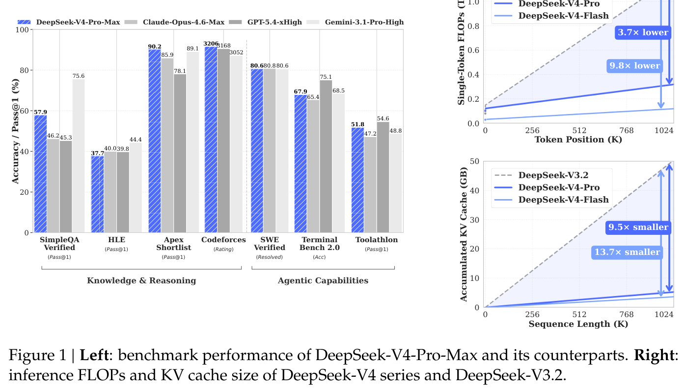

## 3. 整体技术路线

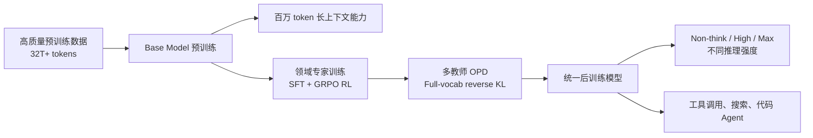

论文的主线可以拆成三层：

| 层次 | 解决的问题 | 关键技术 |
|---|---|---|
| 模型结构 | 百万 token 下注意力和残差传播成本过高 | CSA、HCA、mHC、DeepSeekMoE、MTP |
| 训练与推理系统 | 新结构带来通信、内存、KV Cache 和确定性挑战 | 细粒度 EP（Expert Parallelism，专家并行）、TileLang、确定性 kernel、上下文并行、异构 KV Cache |
| 后训练 | 多领域能力如何合并到一个模型 | Specialist Training、GRPO、Generative Reward Model、OPD、FP4 QAT |

## 4. 整体架构

DeepSeek-V4 保留 Transformer 主体、DeepSeekMoE 和 MTP，但替换和增强了几个关键部件：

- Attention 层：由 `CSA / HCA` 混合组成。
- FFN 层：使用 `DeepSeekMoE`。
- 残差连接：用 `mHC` 增强传统 residual stream。
- 输出侧：保留 `Prediction Head` 和 `MTP Modules`，同时优化 LM Loss 与 MTP Loss。

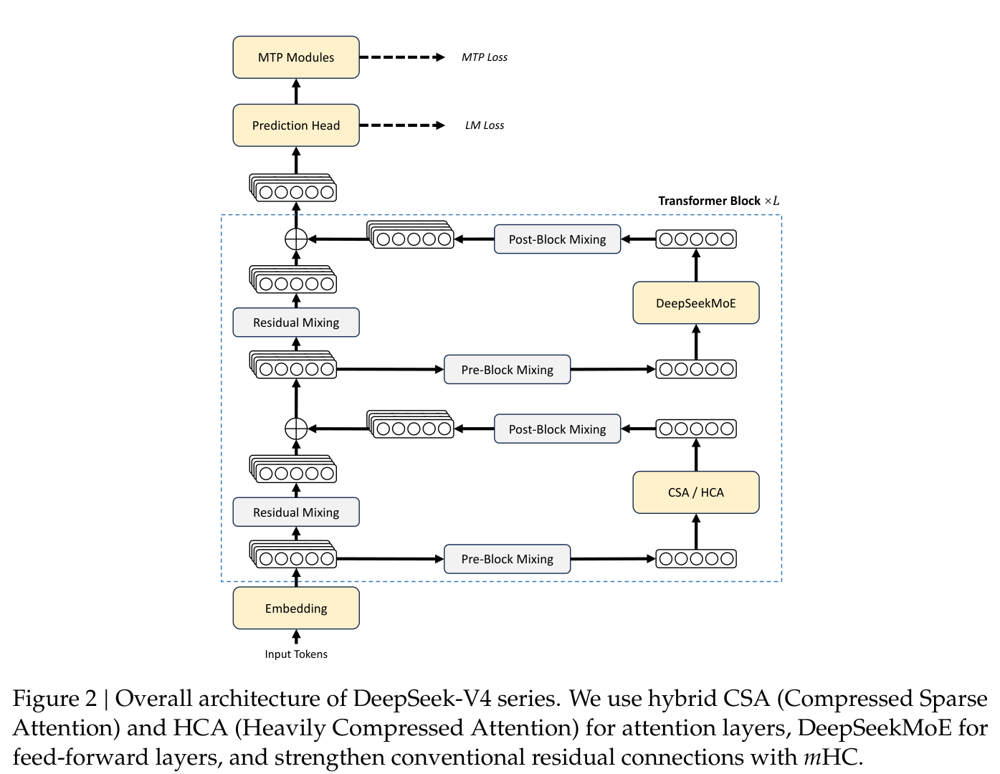

### 4.1 继承自 DeepSeek-V3 的设计

- `DeepSeekMoE`：细粒度 routed experts + shared experts。
- `MTP`：Multi-Token Prediction 继续沿用。
- 负载均衡：使用 auxiliary-loss-free 策略，并加入很小的 sequence-wise balance loss，避免单个序列内部极端不均衡。
- MoE routing：亲和度激活从 `Sigmoid` 改为 `Sqrt(Softplus)`。
- 前几层 MoE 使用 Hash routing，目标是提升早期层路由稳定性和效率。

## 5. mHC：Manifold-Constrained Hyper-Connections

传统残差连接可以写成：

$$
x_{l+1} = x_l + F_l(x_l)
$$

Hyper-Connections 的思路是把 residual stream 从 `d` 维扩展成 `n_hc × d`，让残差通道本身也可学习：

$$
X_{l+1} = B_l X_l + C_l F_l(A_l X_l)
$$

其中：

- $X_l \in \mathbb{R}^{n_{hc} \times d}$：第 `l` 层前的扩展残差状态。
- $A_l \in \mathbb{R}^{1 \times n_{hc}}$：从扩展残差流中混合出当前层输入，H_pre。
- $B_l \in \mathbb{R}^{n_{hc} \times n_{hc}}$：残差流之间的变换，H_res。
- $C_l \in \mathbb{R}^{n_{hc} \times 1}$：把当前层输出写回扩展残差流，H_post。

mHC 的核心改动是：把 `B_l` 限制在双随机矩阵流形，也就是 Birkhoff polytope(多胞形)：

$$
\mathcal{M} = \{M \in \mathbb{R}^{n \times n} \mid M\mathbf{1}_n = \mathbf{1}_n,\ \mathbf{1}_n^T M = \mathbf{1}_n^T,\ M \ge 0\}
$$

这样做的意义：

- `B_l` 的谱范数不超过 1，残差变换是 non-expansive，不容易放大信号。
- 多层矩阵相乘仍然稳定，因为双随机矩阵集合对乘法封闭。
- Birkhoff多胞形是置换矩阵的凸包（加权平均），H_res是一种能量守恒的特征融合。
- `A_l` 和 `C_l` 也用 Sigmoid 做非负和有界约束，降低信号抵消风险。
- `B_l` 通过 Sinkhorn-Knopp 迭代投影到双随机矩阵集合，首先指数运算元素变正，然后交替缩放行和列做迭代归一化，论文中使用 `20` 次迭代。

mHC 的动态参数生成过程：

$$
\hat{X}_l = \mathrm{RMSNorm}(\mathrm{vec}(X_l))
$$

$$
\tilde{A}_l = \alpha_l^{pre} \cdot (\hat{X}_l W_l^{pre}) + S_l^{pre}
$$

$$
\tilde{B}_l = \alpha_l^{res} \cdot \mathrm{Mat}(\hat{X}_l W_l^{res}) + S_l^{res}
$$

$$
\tilde{C}_l = \alpha_l^{post} \cdot (\hat{X}_l W_l^{post})^T + S_l^{post}
$$

输入/输出映射用 Sigmoid 做有界约束：

$$
A_l = \sigma(\tilde{A}_l)
$$

$$
C_l = 2\sigma(\tilde{C}_l)
$$

残差映射通过 Sinkhorn-Knopp 投影到双随机矩阵流形：

$$
M^{(0)} = \exp(\tilde{B}_l)
$$

$$
M^{(t)} = T_r(T_c(M^{(t-1)}))
$$

$$
B_l = M^{(t_{max})}
$$

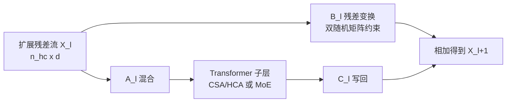

学习要点：mHC 的目标不是替换注意力或 MoE，而是提供一个更稳定、更宽的 residual communication channel，让深层模型在训练时更不容易出现信号爆炸或退化。

## 6. 混合注意力：CSA + HCA

DeepSeek-V4 的长上下文效率主要来自混合注意力：

- `CSA`：Compressed Sparse Attention，先压缩 KV，再稀疏选择。
- `HCA`：Heavily Compressed Attention，更重压缩 KV，但保持 dense attention。
- 两者交错使用，形成既能保留精确信息又能低成本覆盖长距离上下文的结构。

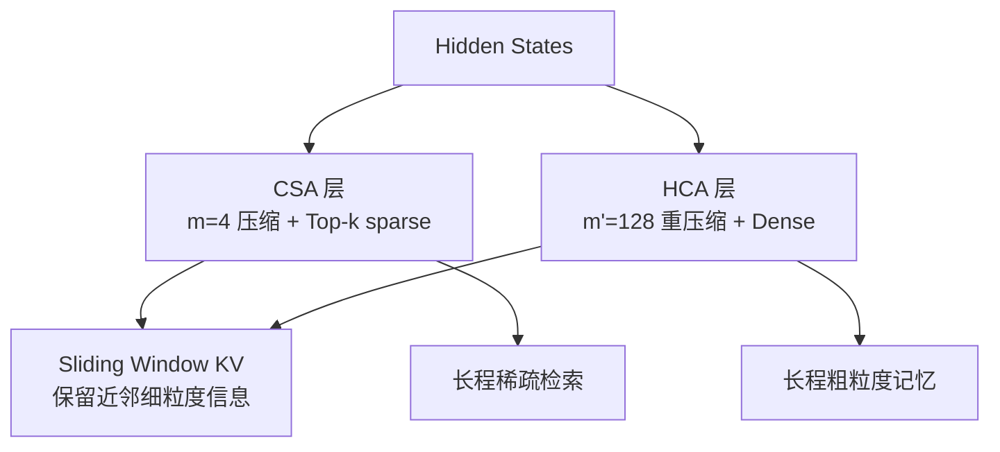

### 6.1 CSA：Compressed Sparse Attention

CSA 分两步：

1. 每 `m` 个 token 的 KV 被压缩成一个 compressed KV entry。
2. 对每个 query，通过 lightning indexer 从压缩后的 KV 中选 Top-k，再执行核心注意力。

论文配置中：

- `m = 4`。
- Flash 的 CSA top-k 为 `512`。
- Pro 的 CSA top-k 为 `1024`。
- 额外加入 sliding window KV，窗口大小 `n_win = 128`，用于保留最近 token 的局部细节。

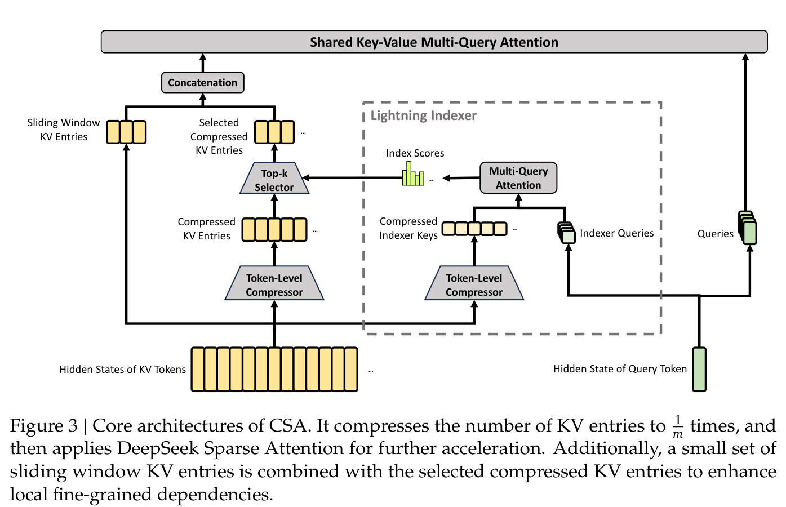

CSA 的关键结构：

- `Token-Level Compressor`：把连续 KV 压缩成 compressed KV entries。
- `Lightning Indexer`：生成 indexer queries 和 compressed indexer keys，计算 index scores。
- `Top-k Selector`：只选择最相关的 compressed KV entries。
- `Shared Key-Value MQA`：压缩后的 KV 同时作为 key 和 value，降低 KV 存储成本。
- `Sliding Window KV`：最近 n_win 个未压缩 KV，补充局部未压缩细节，DeepSeek-V4 里：n_win = 128。

CSA 首先从 hidden states 生成两组 KV entries 和压缩权重，当前块a和前一个块b：

$$
C^a = H W_{KV}^a,\quad C^b = H W_{KV}^b
$$

$$
Z^a = H W_Z^a,\quad Z^b = H W_Z^b
$$

其中 $H \in \mathbb{R}^{n \times d}$，$n$ 是序列长度，$d$ 是 hidden size。第 `i` 个 compressed KV entry 的权重由相邻两段 token 的权重共同决定：

$$
\left[ S^a_{mi:m(i+1)-1}; S^b_{m(i-1):mi-1} \right] = \mathrm{Softmax}_{row} \left( \left[ Z^a_{mi:m(i+1)-1}+B^a; Z^b_{m(i-1):mi-1}+B^b \right] \right)
$$

压缩后的 KV entry：

$$
C_i^{Comp} = \sum_{j=mi}^{m(i+1)-1} S_j^a \odot C_j^a + \sum_{j=m(i-1)}^{mi-1} S_j^b \odot C_j^b
$$

其中 $\odot$ 表示逐元素乘法。CSA 的压缩率为 $1/m$，论文配置中 $m=4$，$B^a, B^b$ 是可学习的位置偏置。

Lightning Indexer 使用低秩方式生成 indexer query：

$$
c_t^Q = h_t W^{DQ}
$$

$$
q_t^I = c_t^Q W^{IUQ}
$$

同时生成每个 indexer head 的权重：

$$
w_t^I = h_t W^w
$$

query token $t$ 与压缩块 $s$ 的 index score：

$$
I_{t,s} = \sum_{h=1}^{n_h^I} w_{t,h}^I \cdot \mathrm{ReLU} \left( q_{t,h}^I \cdot K_s^{IComp} \right)
$$

Top-k 选择得到 query token $t$ 可见的压缩 KV 集合，DeepSeek-V4 中：Flash 的 CSA top-k 是 512；Pro 的 CSA top-k 是 1024：

$$
C_t^{SprsComp} = \{C_s^{Comp} \mid I_{t,s} \in \mathrm{Top}\text{-}k(I_{t,:})\}
$$

最后执行 shared key-value MQA（这里 compressed KV 同时作为 key 和 value）：

$$
q_t = c_t^Q W^{UQ}
$$

$$
o_{t,i} = \mathrm{CoreAttn} \left( \text{query}=q_{t,i}, \text{key}=C_t^{SprsComp}, \text{value}=C_t^{SprsComp} \right)
$$

学习理解：CSA 类似「先把长书按段压缩成摘要，再用一个轻量检索器挑出当前问题最相关的段落，最后只读这些段落和最近几句话」。

### 6.2 HCA：Heavily Compressed Attention

HCA 的思路更激进：每 `m'` 个 token 压缩成一个 KV entry，并对这些高度压缩的 KV 做 dense attention。

论文配置中：

- `m' = 128`。
- 不使用 Top-k sparse selector。
- 同样加入 `n_win = 128` 的 sliding window KV。

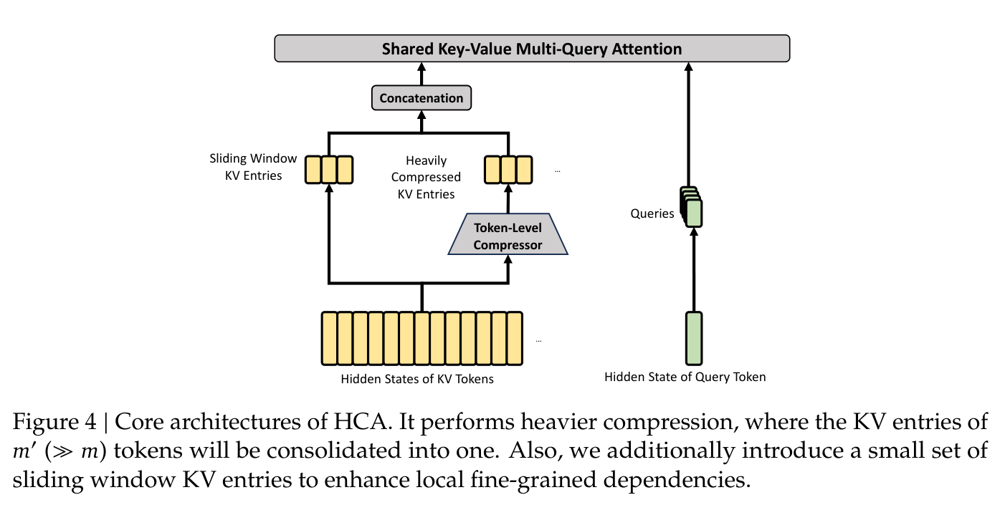

HCA 只生成一组 KV entries 和压缩权重：

$$
C = H W^{KV}
$$

$$
Z = H W^Z
$$

第 `i` 个 heavily compressed KV entry 的权重：

$$
S_{m'i:m'(i+1)-1} = \mathrm{Softmax}_{row} \left( Z_{m'i:m'(i+1)-1} + B \right)
$$

压缩后的 KV entry：

$$
C_i^{Comp} = \sum_{j=m'i}^{m'(i+1)-1} S_j \odot C_j
$$

HCA 的压缩率为 $1/m'$，论文配置中 $m'=128$。之后它不做 Top-k 稀疏选择，而是对压缩后的 KV 做 dense attention：

$$
o_{t,i} = \mathrm{CoreAttn} \left( \text{query}=q_{t,i}, \text{key}=C^{Comp}, \text{value}=C^{Comp} \right)
$$

学习理解：HCA 更像「为超长上下文建立粗粒度全局记忆」，牺牲细节精度，换取极低的长程访问成本。

### 6.3 CSA 与 HCA 的分工

| 机制 | 压缩强度 | 是否稀疏选择 | 优势 | 适合捕捉 |
|---|---:|---|---|---|
| CSA | 中等，`m=4` | 是，Top-k | 精度和效率折中 | 重要长程依赖 |
| HCA | 很强，`m'=128` | 否，dense over compressed KV | 成本极低，覆盖全局 | 粗粒度全局背景 |
| Sliding Window | 不压缩 | 局部窗口 | 保留最近细节 | 局部语法和短程依赖 |

### 6.4 其他注意力细节

- Query 和 compressed KV 在 core attention 前额外做 RMSNorm，抑制 attention logits 爆炸。
- 对 query、KV 和输出的最后 `64` 维使用部分 RoPE。
- 对 attention output 施加反向位置处理，让输出更接近相对位置表达。
- 使用 attention sink，使某些 head 可以把总注意力质量调低，甚至接近 0。
- KV 存储采用混合精度：RoPE 维度用 BF16，其余维度用 FP8。
- Lightning indexer 的部分计算使用 FP4，进一步降低长上下文成本。

Attention Sink 的公式如下，其中 $z'_h$ 是第 $h$ 个 head 的可学习 sink logit：

$$
s_{h,i,j} = \frac{ \exp(z_{h,i,j}) }{ \sum_k \exp(z_{h,i,k}) + \exp(z'_h) }
$$

这个分母额外加入 sink 项后，某个 head 分配给真实 KV 的总注意力质量可以小于 1。

## 7. Muon 优化器

DeepSeek-V4 大多数参数使用 Muon，少数模块仍使用 AdamW：

- AdamW：Embedding、Prediction Head、RMSNorm 权重、mHC 的静态偏置和 gate 等。
- Muon：大多数 dense 和 MoE 参数。

Muon 的关键思想：

```text
梯度 -> momentum -> Nesterov -> Newton-Schulz 近似正交化 -> RMS rescale -> 参数更新
```

对一个逻辑独立的权重矩阵 $W \in \mathbb{R}^{n \times m}$，Muon 的核心更新为：

$$
G_t = \nabla_W \mathcal{L}_t(W_{t-1})
$$

$$
M_t = \mu M_{t-1} + G_t
$$

$$
O'_t = \mathrm{HybridNewtonSchulz}(\mu M_t + G_t)
$$

$$
O_t = O'_t \cdot \sqrt{\max(n,m)} \cdot \gamma
$$

$$
W_t = W_{t-1}(1-\eta\lambda) - \eta O_t
$$

其中 $\eta$ 是 learning rate，$\mu$ 是 momentum，$\lambda$ 是 weight decay，$\gamma$ 是 update rescaling factor。

论文中的 Muon 使用 hybrid Newton-Schulz：

- 共 `10` 次迭代。
- 前 `8` 次用快速收敛系数，把奇异值推近 1。
- 后 `2` 次用更稳定的系数，把奇异值稳定在 1 附近。

Hybrid Newton-Schulz 近似正交化的迭代形式：

$$
M_k = aM_{k-1} + b(M_{k-1}M_{k-1}^T)M_{k-1} + c(M_{k-1}M_{k-1}^T)^2M_{k-1}
$$

为什么重要：

- 对大矩阵更新做近似正交化，改善更新方向。
- 更快收敛，更强训练稳定性。
- 与 mHC、MoE、长上下文注意力一起构成大规模训练稳定性的基础。

## 8. 模型规格

| 项目 | DeepSeek-V4-Flash | DeepSeek-V4-Pro |
|---|---:|---:|
| 总参数 | 284B | 1.6T |
| 激活参数 | 13B | 49B |
| Transformer 层数 | 43 | 61 |
| Hidden size | 4096 | 7168 |
| CSA 压缩率 | m=4 | m=4 |
| CSA top-k | 512 | 1024 |
| HCA 压缩率 | m'=128 | m'=128 |
| Attention query heads | 64 | 128 |
| Head dim | 512 | 512 |
| Sliding window | 128 | 128 |
| Routed experts | 256 | 384 |
| 每 token 激活 routed experts | 6 | 6 |
| Shared experts | 1 | 1 |
| MTP depth | 1 | 1 |
| mHC expansion | 4 | 4 |

## 9. 训练数据与预训练设置

数据构成：

- 在 DeepSeek-V3 数据基础上进一步提升多样性和质量。
- 强化数学、代码、agentic data、多语言长尾知识。
- 特别强调长文档数据，如论文、技术报告和学术材料。
- 总预训练语料超过 `32T tokens`。
- tokenizer 词表大小仍为 `128K`。
- 继续使用 token-splitting、FIM，并引入 sample-level attention masking。

训练设置：

| 项目 | Flash | Pro |
|---|---:|---:|
| 训练 token | 32T | 33T |
| 最大 batch tokens | 75.5M | 94.4M |
| 峰值学习率 | 2.7e-4 | 2.0e-4 |
| 末尾学习率 | 2.7e-5 | 2.0e-5 |
| 序列长度课程 | 4K -> 16K -> 64K -> 1M | 4K -> 16K -> 64K -> 1M |
| MTP loss 权重 | 大部分训练 0.3，LR decay 后 0.1 | 同左 |

稀疏注意力训练策略：

- 先用 dense attention warmup。
- 到 `64K` 序列长度后引入 sparse attention。
- 引入时先短阶段 warm up CSA 的 lightning indexer。
- 之后在大部分训练中保持 sparse attention。

## 10. 训练稳定性技巧

论文指出 trillion-parameter MoE 训练中遇到了明显 loss spike，主要与 MoE outlier 和 routing 机制有关。

### 10.1 Anticipatory Routing

普通 routing 使用当前参数 `theta_t` 计算当前 batch 的路由。Anticipatory Routing 改为：

```text
当前 step 用 theta_t 计算特征
但 routing index 来自历史参数 theta_{t-delta}
```

工程上提前读取 step `t` 的数据，在 step `t-delta` 时先算好 routing index 并缓存。这样让 backbone 更新和 routing 更新解耦，降低路由导致的正反馈不稳定。

论文还提到只在检测到 loss spike 时短期启用该机制，稳定后再回到标准训练，因此总体额外开销很小。

### 10.2 SwiGLU Clamping

对 SwiGLU 做数值裁剪：

- linear component 限制在 `[-10, 10]`。
- gate component 上界限制为 `10`。

作用是抑制 MoE 层 outlier，减少训练不稳定。

## 11. 系统与基础设施

### 11.1 细粒度 EP：通信与计算重叠

MoE 的 expert parallelism 会带来大量跨节点通信。DeepSeek-V4 把 MoE 层拆成：

- Dispatch
- Linear-1
- Activation / FP8 cast
- Linear-2
- Combine

然后按 expert wave 切分并调度，让当前 wave 计算、下一 wave dispatch、上一 wave combine 同时进行。

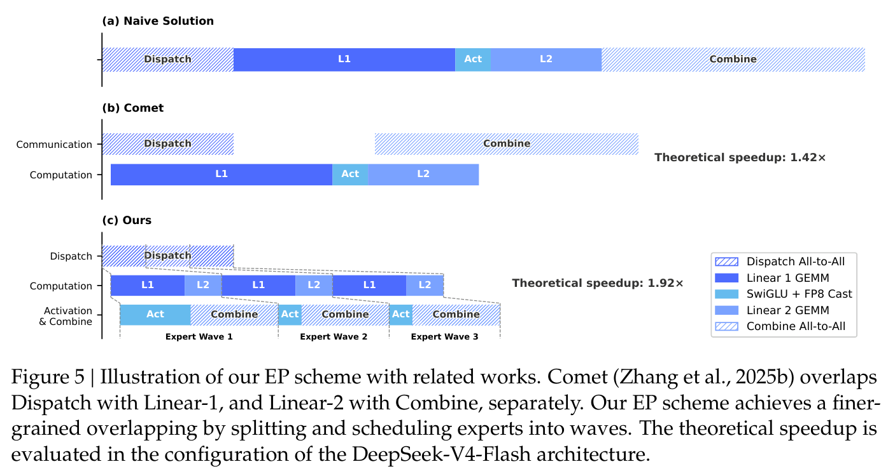

论文报告该方案在一般推理负载下相对强非融合基线有 `1.50x ~ 1.73x` 加速，在 RL rollout 和 agent serving 等延迟敏感场景最高约 `1.96x`。

这个设计的判断依据是通信能否被计算隐藏。若峰值计算吞吐为 $C$，互联带宽为 $B$，计算量为 $V_{comp}$，通信量为 $V_{comm}$，通信可被隐藏的条件为：

$$
\frac{C}{B} \le \frac{V_{comp}}{V_{comm}}
$$

对 DeepSeek-V4-Pro，论文给出的近似化简为：

$$
\frac{C}{B} \le 2d = 6144\ \mathrm{FLOPs/Byte}
$$

含义是每 `1 GB/s` 互联带宽大约足以隐藏 `6.1 TFLOP/s` 的计算通信需求；超过这个平衡点后，继续堆互联带宽的收益会下降。

### 11.2 TileLang 与确定性 kernel

TileLang 的角色：

- 用 DSL 快速开发 fused kernels，替代大量细粒度 Torch ATen operators。
- Host Codegen 把运行时检查和参数封送从 Python 路径移到生成的 host launcher，降低 CPU 调度开销。
- 引入 Z3 SMT solver 做整数表达式分析，用于布局推断、边界分析、向量化和 barrier 插入等优化。
- 默认重视数值正确性和 bitwise reproducibility。

确定性 kernel 的目的：

- 同一个 token 的输出不应因为 batch 位置不同而变化。
- 训练、后训练、推理之间尽量 bitwise 对齐。
- 方便定位 loss spike、硬件错误和软件回归。

### 11.3 训练框架

关键优化：

- Muon 与 ZeRO 冲突，因此设计 hybrid ZeRO bucket assignment。
- MoE 专家参数按逻辑独立矩阵处理，避免切开单个矩阵。
- 相同形状参数合并，批量执行 Newton-Schulz，提高硬件利用率。
- MoE 梯度同步前随机舍入到 BF16，减少通信量。
- mHC 通过 fused kernels、选择性 recomputation 和调整 pipeline overlap 降低开销。
- 对 CSA/HCA 的上下文并行设计两阶段通信，解决压缩块跨 rank 边界的问题。
- 扩展 autograd，支持 tensor-level activation checkpointing。

## 12. 推理框架与 KV Cache

DeepSeek-V4 的 KV Cache 不再是单一形态，因为 CSA、HCA、SWA 的 KV 类型、长度和更新规则都不同。

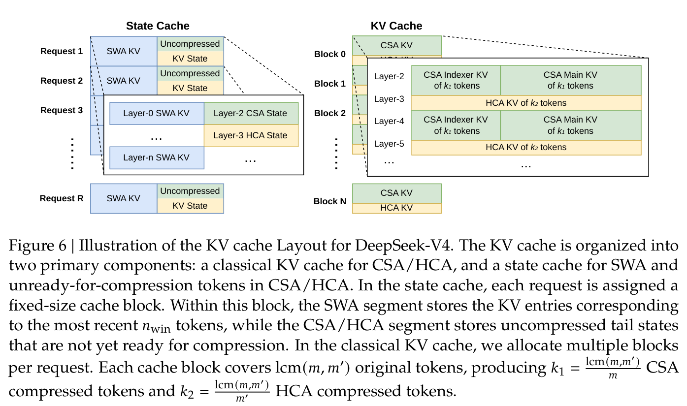

论文把 KV Cache 分成两类：

| 类型 | 内容 | 用途 |
|---|---|---|
| State Cache | SWA KV、尚未凑满压缩块的 uncompressed tail state | 维护每个 request 的局部状态 |
| Classical KV Cache | CSA/HCA 压缩 KV、CSA indexer KV、CSA main KV | 存储长上下文压缩记忆 |

每个 classical cache block 覆盖 `lcm(m, m')` 个原始 token，因此能同时对齐 CSA 和 HCA 的压缩块。

因此一个 block 内包含：

$$
k_1 = \frac{\mathrm{lcm}(m,m')}{m}
$$

个 CSA compressed tokens，以及：

$$
k_2 = \frac{\mathrm{lcm}(m,m')}{m'}
$$

个 HCA compressed tokens。论文配置中 $m=4$、$m'=128$，所以：

$$
\mathrm{lcm}(4,128)=128
$$

$$
k_1 = 32,\quad k_2 = 1
$$

### 12.1 On-disk KV Cache

为共享前缀请求减少重复 prefilling，DeepSeek-V4 把 KV Cache 存到磁盘：

- CSA/HCA：直接存所有压缩 KV entries。
- SWA：因为体积大，提供三种策略。

| 策略 | 优点 | 缺点 |
|---|---|---|
| Full SWA Caching | 命中前缀后几乎无需重算 | 写入量和存储压力大 |
| Periodic Checkpointing | 存储和重算可调 | 需要选择 checkpoint 间隔 |
| Zero SWA Caching | 存储最省 | 命中后需要更多重算 |

## 13. 后训练：Specialists + OPD

DeepSeek-V4 后训练的核心变化是：用 On-Policy Distillation 替代混合 RL 作为最终能力合并阶段。

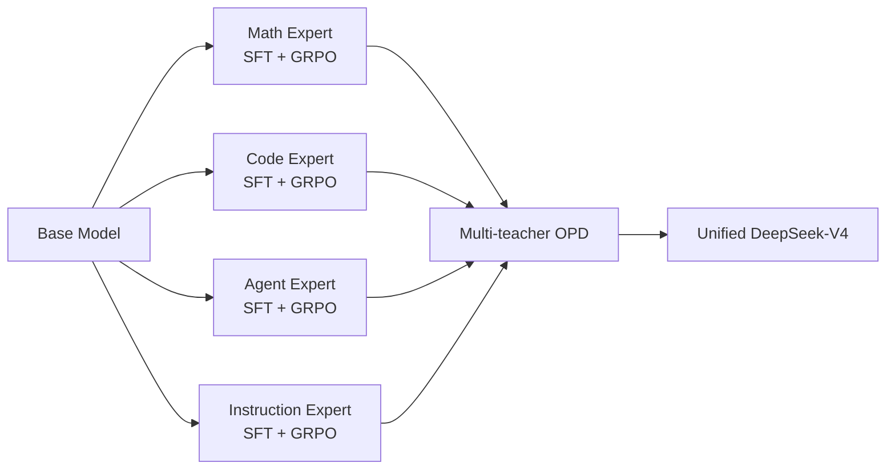

### 13.1 Specialist Training

每个领域独立训练专家模型：

1. 用高质量领域数据做 SFT。
2. 用 GRPO 做 RL。
3. 数学、代码、Agent、指令跟随等领域分别构造 reward 和 prompt。

### 13.2 三种推理强度

| 模式 | 特点 | 适合场景 |
|---|---|---|
| Non-think | 快速、直觉式、低成本 | 日常任务、低风险问答 |
| Think High | 显式逻辑分析，较慢更准 | 复杂问题、规划、中等风险任务 |
| Think Max | 最大化推理 effort | 探索模型能力边界、困难推理 |

### 13.3 Generative Reward Model

传统 RLHF 常用 scalar reward model。DeepSeek-V4 对 hard-to-verify 任务使用 Generative Reward Model：

- 不单独训练一个只输出分数的 RM。
- 让 actor 本身也承担评价能力。
- 用 rubric-guided data 让模型生成式地判断轨迹质量。
- 评价过程利用模型自身推理能力，减少人工标注需求。

### 13.4 On-Policy Distillation

OPD 的目标是让统一学生模型在自己采样出的轨迹上，向多个专家教师的输出分布靠拢。论文使用 reverse KL：

$$
\mathcal{L}_{OPD}(\theta) = \sum_{i=1}^{N} w_i \cdot D_{KL} \left( \pi_\theta \Vert \pi_{E_i} \right)
$$

其中 $\pi_\theta$ 是统一学生模型，$\pi_{E_i}$ 是第 `i` 个专家教师模型，$w_i$ 是该专家的权重。

关键点：

- 训练样本来自 student 当前策略，因此是 on-policy。
- 使用 `full-vocabulary logit distillation`，不是只在采样 token 上估 KL。
- 多个专家教师超过 10 个，覆盖不同领域。
- 通过 logits-level alignment 把物理上不同的专家权重合并到一个统一参数空间。

为什么用 full-vocab：

- token-level KL 估计方差高，容易训练不稳定。
- full-vocab KL 梯度更稳定，更能保留教师分布信息。

如果展开到完整词表上的单步分布，可理解为：

$$
D_{KL}(\pi_\theta \Vert \pi_E) = \sum_{y \in \mathcal{V}} \pi_\theta(y \mid x) \log \frac{ \pi_\theta(y \mid x) }{ \pi_E(y \mid x) }
$$

## 14. 工具调用与 Thinking 管理

DeepSeek-V4 使用新的 DSML/XML 风格工具调用格式，减少 JSON escaping 失败和 tool-call 错误。

Thinking 管理策略根据场景不同而不同：

- 工具调用场景：保留完整 reasoning history，跨用户消息边界也保留。
- 普通对话场景：新用户消息到来后丢弃旧 reasoning，只保留对话内容。

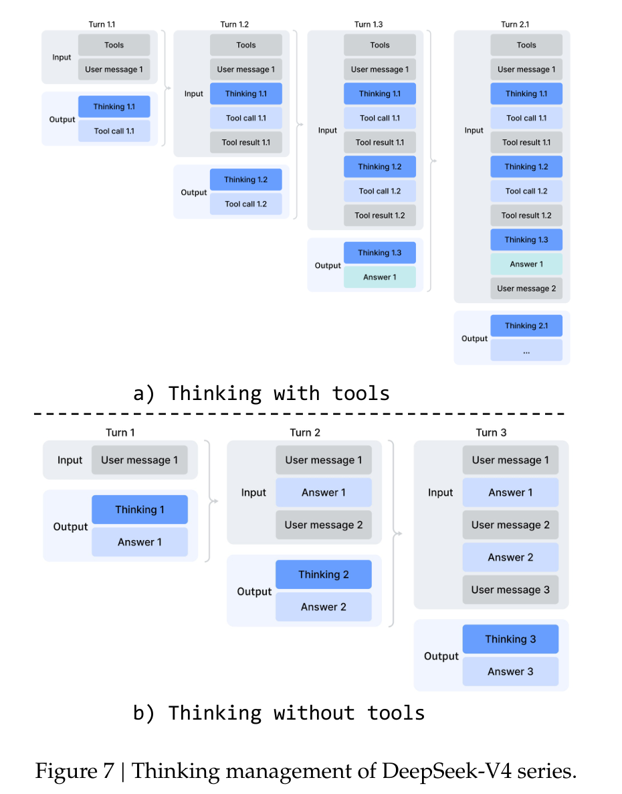

学习理解：1M context 的意义不仅是能读长文档，也能让 agent 在多轮工具调用中保留长期问题求解状态。

## 15. Quick Instruction

Quick Instruction 用特殊 token 直接在主模型里执行辅助任务，避免再调用小模型造成重复 prefill。

典型任务：

- 是否需要搜索。
- 生成搜索 query。
- 判断 source authority 需求。
- 判断 prompt domain。
- URL 是否需要读取。
- 生成会话标题。

优点：

- 复用主请求已有 KV Cache。
- 减少 TTFT。
- 避免维护额外小模型。

## 16. 后训练基础设施

### 16.1 FP4 QAT

FP4 Quantization-Aware Training 作用于：

- MoE expert weights。
- CSA indexer 的 QK path。

论文还把 index scores 从 FP32 量化到 BF16，使 Top-k selector 约 `2x` 加速，同时保持约 `99.7%` KV entry recall。

### 16.2 多教师调度

Full-vocab OPD 如果直接缓存所有教师 logits，内存不可接受。论文的策略：

- 教师权重 offload 到分布式存储，按需加载。
- 前向时缓存 last-layer hidden states，不直接缓存完整 logits。
- 训练时再通过对应 prediction head 重建 full logits。
- 按 teacher index 排列样本，让每个 mini-batch 最多只加载一个 teacher head。
- 用专门 TileLang kernel 计算 KL。

### 16.3 Rollout 容错

RL/OPD rollout 需要长时间自回归采样，集群又可能被抢占或出现硬件故障。论文采用 token-granular WAL：

- 每生成一个 token 就写入 WAL。
- 抢占时保存未完成请求的 KV Cache。
- 恢复时用 WAL 和 KV Cache 继续 decoding。
- fatal error 时可用 WAL 重新 prefill 重建 KV Cache。

这避免了「中断后从头重新采样」导致的长度偏差。

### 16.4 DSec 沙箱

DSec 用于 agentic AI 的训练和评估，支持：

- Function Call
- Container
- microVM
- fullVM

统一 API 支持命令执行、文件传输、TTY。通过 layered storage、trajectory log 和 preemption-safe resumption 支撑大规模 sandbox 并发。

## 17. 标准评测方法与结果详解

这一节不只记录分数，还要说明论文如何评测、和哪些竞品比较、不同模式如何设置，以及这些结果说明了 DeepSeek-V4 的哪些强项和短板。注意：不同表中的模型模式不同，`Max`、`High`、`xHigh` 指推理强度；`Non-Think` 指不显式展开推理的快速模式。

### 17.1 评测方式与竞品范围

论文的评测分成两条线：

- **Base Model 评测**：比较 `DeepSeek-V3.2-Base`、`DeepSeek-V4-Flash-Base`、`DeepSeek-V4-Pro-Base`，目的是验证架构、数据和预训练本身是否带来基础能力提升。
- **Post-trained Model 评测**：比较最终后训练模型，重点看 `DeepSeek-V4-Pro-Max` 与外部闭源/开源竞品，以及 `V4-Flash / V4-Pro` 在不同推理强度下的能力变化。

Base Model 使用统一内部评测框架，覆盖四类任务：

| 评测维度 | 代表 benchmark | 主要考察能力 |
|---|---|---|
| 世界知识 | AGIEval、MMLU、MMLU-Pro、C-Eval、CMMLU、MultiLoKo、Simple-QA verified、SuperGPQA、FACTS Parametric、TriviaQA | 参数化知识、中文/多语知识、事实准确性 |
| 语言理解与推理 | BBH、DROP、HellaSwag、WinoGrande、CLUEWSC | 常识、阅读理解、离散推理、指代消解 |
| 代码与数学 | BigCodeBench、HumanEval、GSM8K、MATH、MGSM、CMath | 编程、数学解题、多语言数学 |
| 长上下文 | LongBench-V2 | 长文本理解与推理 |

后训练模型的标准 benchmark 覆盖更广：

| 评测维度 | 代表 benchmark | 评测方式要点 |
|---|---|---|
| 知识与推理 | MMLU-Pro、GPQA、HLE、SimpleQA-Verified、Chinese-SimpleQA | 对比闭源和开源模型；使用不同 reasoning effort |
| 代码 | LiveCodeBench-v6、Codeforces 内部集 | Codeforces 采集 2025 年 5-11 月 14 场 Div.1 比赛，共 114 题 |
| 数学 | HMMT 2026 Feb、Apex、Apex Shortlist、IMOAnswerBench、PutnamBench | 普通数学问答和形式化证明都覆盖 |
| 1M 长上下文 | MRCR、CorpusQA | MRCR 偏“多针检索”，CorpusQA 更接近真实语料分析 |
| Agent | Terminal Bench 2.0、SWE Verified、SWE Multilingual、SWE-Pro、BrowseComp、MCPAtlas、GDPval-AA、Toolathlon | 代码 Agent、搜索 Agent、工具调用与 MCP 服务能力 |

推理模式设置：

| 模式 | 上下文窗口 | 典型用途 |
|---|---:|---|
| Non-think | 8K | 快速回答、低成本日常任务 |
| High | 128K | 复杂问题、规划、较高准确率任务 |
| Max | 384K | 困难数学、代码竞赛、长程 Agent、能力上限评测 |

Codeforces 的评分方式比较复杂：论文不是简单看一次提交是否通过，而是每题生成 `32` 个候选解，从中随机抽取 `10` 个形成提交序列；每个提交用专家构造测试集判定，并按照人类比赛中的罚时/失败尝试逻辑换算 contest score，再换算到 Codeforces rating。最终 rating 是 14 场比赛期望 rating 的平均。

形式化数学使用 Lean `v4.28.0-rc1`，模型可调用 Lean 编译器和 semantic tactic search engine，最多 `500` 次工具调用。论文还评测了更重的 pipeline：先生成自然语言解法并自验证筛选，再把保留的解法交给形式化 Agent 证明；最终只有严格 verifier 接受才算正确。

Agent 类评测中，代码 Agent 使用内部评测框架，工具集保持很小，主要是 bash 和文件编辑工具；最大交互步数 `500`，最大上下文 `512K`。搜索 Agent 使用 web search 和 Python 工具，同样最多 `500` 步、`512K` 上下文。

竞品覆盖了闭源前沿模型和开源/开放权重模型：

| 类别 | 模型 |
|---|---|
| 闭源前沿 | Claude Opus 4.6 Max、GPT-5.4 xHigh、Gemini-3.1-Pro High |
| 开源/开放强模型 | Kimi K2.6 Thinking、GLM-5.1 Thinking |
| DeepSeek 内部对照 | DeepSeek-V3.2、DeepSeek-V4-Flash、DeepSeek-V4-Pro |

### 17.2 Base Model：V3.2-Base vs V4-Flash-Base vs V4-Pro-Base

基础模型评测的核心结论是：`V4-Flash-Base` 用更小的总参数和激活参数，已经在多数指标上超过 `V3.2-Base`；`V4-Pro-Base` 则在知识、长上下文和多数推理任务上进一步拉开差距。

| 模型 | 架构 | 激活参数 | 总参数 |
|---|---|---:|---:|
| DeepSeek-V3.2-Base | MoE | 37B | 671B |
| DeepSeek-V4-Flash-Base | MoE | 13B | 284B |
| DeepSeek-V4-Pro-Base | MoE | 49B | 1.6T |

**世界知识类：**

| Benchmark | Shots | V3.2-Base | V4-Flash-Base | V4-Pro-Base |
|---|---:|---:|---:|---:|
| AGIEval EM | 0-shot | 80.1 | 82.6 | 83.1 |
| MMLU EM | 5-shot | 87.8 | 88.7 | 90.1 |
| MMLU-Redux EM | 5-shot | 87.5 | 89.4 | 90.8 |
| MMLU-Pro EM | 5-shot | 65.5 | 68.3 | 73.5 |
| MMMLU EM | 5-shot | 87.9 | 88.8 | 90.3 |
| C-Eval EM | 5-shot | 90.4 | 92.1 | 93.1 |
| CMMLU EM | 5-shot | 88.9 | 90.4 | 90.8 |
| MultiLoKo EM | 5-shot | 38.7 | 42.2 | 51.1 |
| Simple-QA verified EM | 25-shot | 28.3 | 30.1 | 55.2 |
| SuperGPQA EM | 5-shot | 45.0 | 46.5 | 53.9 |
| FACTS Parametric EM | 25-shot | 27.1 | 33.9 | 62.6 |
| TriviaQA EM | 5-shot | 83.3 | 82.8 | 85.6 |

**语言理解与推理类：**

| Benchmark | Shots | V3.2-Base | V4-Flash-Base | V4-Pro-Base |
|---|---:|---:|---:|---:|
| BBH EM | 3-shot | 87.6 | 86.9 | 87.5 |
| DROP F1 | 1-shot | 88.2 | 88.6 | 88.7 |
| HellaSwag EM | 0-shot | 86.4 | 85.7 | 88.0 |
| WinoGrande EM | 0-shot | 78.9 | 79.5 | 81.5 |
| CLUEWSC EM | 5-shot | 83.5 | 82.2 | 85.2 |

**代码、数学与长上下文：**

| Benchmark | Shots | V3.2-Base | V4-Flash-Base | V4-Pro-Base |
|---|---:|---:|---:|---:|
| BigCodeBench Pass@1 | 3-shot | 63.9 | 56.8 | 59.2 |
| HumanEval Pass@1 | 0-shot | 62.8 | 69.5 | 76.8 |
| GSM8K EM | 8-shot | 91.1 | 90.8 | 92.6 |
| MATH EM | 4-shot | 60.5 | 57.4 | 64.5 |
| MGSM EM | 8-shot | 81.3 | 85.7 | 84.4 |
| CMath EM | 3-shot | 92.6 | 93.6 | 90.9 |
| LongBench-V2 EM | 1-shot | 40.2 | 44.7 | 51.5 |

读表要点：

- `V4-Flash-Base` 的优势主要说明架构和训练数据质量带来了参数效率提升。
- `V4-Pro-Base` 在知识密集任务上提升最明显，例如 Simple-QA verified、FACTS Parametric、MultiLoKo。
- 代码数学并非所有项都单调提升，例如 BigCodeBench 中 V3.2-Base 更高，说明 base 阶段能力仍受数据、评测形式和后训练影响。

### 17.3 DeepSeek-V4-Pro-Max 与外部模型对比

这张表对应论文的标准 benchmark 主表。它把 `DeepSeek-V4-Pro-Max` 与 Claude Opus、GPT、Gemini、Kimi K2.6、GLM-5.1 等模型比较。

| Benchmark | Opus-4.6 Max | GPT-5.4 xHigh | Gemini-3.1-Pro High | K2.6 Thinking | GLM-5.1 Thinking | DS-V4-Pro Max |
|---|---:|---:|---:|---:|---:|---:|
| MMLU-Pro EM | 89.1 | 87.5 | 91.0 | 87.1 | 86.0 | 87.5 |
| SimpleQA-Verified Pass@1 | 46.2 | 45.3 | 75.6 | 36.9 | 38.1 | 57.9 |
| Chinese-SimpleQA Pass@1 | 76.4 | 76.8 | 85.9 | 75.9 | 75.0 | 84.4 |
| GPQA Diamond Pass@1 | 91.3 | 93.0 | 94.3 | 90.5 | 86.2 | 90.1 |
| HLE Pass@1 | 40.0 | 39.8 | 44.4 | 36.4 | 34.7 | 37.7 |
| LiveCodeBench Pass@1 | 88.8 | - | 91.7 | 89.6 | - | 93.5 |
| Codeforces Rating | - | 3168 | 3052 | - | - | 3206 |
| HMMT 2026 Feb Pass@1 | 96.2 | 97.7 | 94.7 | 92.7 | 89.4 | 95.2 |
| IMOAnswerBench Pass@1 | 75.3 | 91.4 | 81.0 | 86.0 | 83.8 | 89.8 |
| Apex Pass@1 | 34.5 | 54.1 | 60.9 | 24.0 | 11.5 | 38.3 |
| Apex Shortlist Pass@1 | 85.9 | 78.1 | 89.1 | 75.5 | 72.4 | 90.2 |
| MRCR 1M MMR | 92.9 | - | 76.3 | - | - | 83.5 |
| CorpusQA 1M ACC | 71.7 | - | 53.8 | - | - | 62.0 |
| Terminal Bench 2.0 Acc | 65.4 | 75.1 | 68.5 | 66.7 | 63.5 | 67.9 |
| SWE Verified Resolved | 80.8 | - | 80.6 | 80.2 | - | 80.6 |
| SWE Pro Resolved | 57.3 | 57.7 | 54.2 | 58.6 | 58.4 | 55.4 |
| SWE Multilingual Resolved | 77.5 | - | - | 76.7 | 73.3 | 76.2 |
| BrowseComp Pass@1 | 83.7 | 82.7 | 85.9 | 83.2 | 79.3 | 83.4 |
| HLE w/ tools Pass@1 | 53.1 | 52.0 | 51.6 | 54.0 | 50.4 | 48.2 |
| GDPval-AA Elo | 1619 | 1674 | 1314 | 1482 | 1535 | 1554 |
| MCPAtlas Public Pass@1 | 73.8 | 67.2 | 69.2 | 66.6 | 71.8 | 73.6 |
| Toolathlon Pass@1 | 47.2 | 54.6 | 48.8 | 50.0 | 40.7 | 51.8 |

读表要点：

- 知识类：`DS-V4-Pro-Max` 明显强于开源竞品，但在 MMLU-Pro、GPQA、HLE 等教育知识指标上仍落后 Gemini-3.1-Pro。
- 中文知识：Chinese-SimpleQA 达到 `84.4`，接近 Gemini-3.1-Pro 的 `85.9`。
- 代码竞赛：LiveCodeBench `93.5`、Codeforces `3206`，是论文中最强势的结果之一。
- 数学推理：Apex Shortlist `90.2` 很强，但 Apex `38.3` 仍低于 Gemini-3.1-Pro `60.9` 和 GPT-5.4 `54.1`。
- 长上下文：MRCR 1M `83.5` 高于 Gemini-3.1-Pro `76.3`，低于 Opus-4.6 `92.9`；CorpusQA 1M `62.0` 高于 Gemini-3.1-Pro `53.8`，低于 Opus-4.6 `71.7`。
- Agent：SWE Verified 与前沿闭源模型接近，但 Terminal Bench 2.0、SWE Pro 和 HLE w/ tools 仍有差距。

### 17.4 DeepSeek-V4 系列不同尺寸与推理强度对比

这张表展示 `Flash` 和 `Pro` 在 `Non-Think / High / Max` 三种模式下的能力变化。

| Benchmark | Flash Non | Flash High | Flash Max | Pro Non | Pro High | Pro Max |
|---|---:|---:|---:|---:|---:|---:|
| MMLU-Pro EM | 83.0 | 86.4 | 86.2 | 82.9 | 87.1 | 87.5 |
| SimpleQA-Verified Pass@1 | 23.1 | 28.9 | 34.1 | 45.0 | 46.2 | 57.9 |
| Chinese-SimpleQA Pass@1 | 71.5 | 73.2 | 78.9 | 75.8 | 77.7 | 84.4 |
| GPQA Diamond Pass@1 | 71.2 | 87.4 | 88.1 | 72.9 | 89.1 | 90.1 |
| HLE Pass@1 | 8.1 | 29.4 | 34.8 | 7.7 | 34.5 | 37.7 |
| LiveCodeBench Pass@1-COT | 55.2 | 88.4 | 91.6 | 56.8 | 89.8 | 93.5 |
| Codeforces Rating | - | 2816 | 3052 | - | 2919 | 3206 |
| HMMT 2026 Feb Pass@1 | 40.8 | 91.9 | 94.8 | 31.7 | 94.0 | 95.2 |
| IMOAnswerBench Pass@1 | 41.9 | 85.1 | 88.4 | 35.3 | 88.0 | 89.8 |
| Apex Pass@1 | 1.0 | 19.1 | 33.0 | 0.4 | 27.4 | 38.3 |
| Apex Shortlist Pass@1 | 9.3 | 72.1 | 85.7 | 9.2 | 85.5 | 90.2 |
| MRCR 1M MMR | 37.5 | 76.9 | 78.7 | 44.7 | 83.3 | 83.5 |
| CorpusQA 1M ACC | 15.5 | 59.3 | 60.5 | 35.6 | 56.5 | 62.0 |
| Terminal Bench 2.0 Acc | 49.1 | 56.6 | 56.9 | 59.1 | 63.3 | 67.9 |
| SWE Verified Resolved | 73.7 | 78.6 | 79.0 | 73.6 | 79.4 | 80.6 |
| SWE Pro Resolved | 49.1 | 52.3 | 52.6 | 52.1 | 54.4 | 55.4 |
| SWE Multilingual Resolved | 69.7 | 70.2 | 73.3 | 69.8 | 74.1 | 76.2 |
| BrowseComp Pass@1 | - | 53.5 | 73.2 | - | 80.4 | 83.4 |
| HLE w/ tools Pass@1 | - | 40.3 | 45.1 | - | 44.7 | 48.2 |
| MCPAtlas Public Pass@1 | 64.0 | 67.4 | 69.0 | 69.4 | 74.2 | 73.6 |
| GDPval-AA Elo | - | - | 1395 | - | - | 1554 |
| Toolathlon Pass@1 | 40.7 | 43.5 | 47.8 | 46.3 | 49.0 | 51.8 |

读表要点：

- 推理强度收益最大的是困难推理任务：HLE、Apex、Apex Shortlist、Codeforces、LiveCodeBench。
- `Flash-Max` 在很多推理任务上接近 `Pro-Max`，说明 test-time compute 能部分弥补模型规模差距。
- 知识类任务仍明显依赖模型规模，例如 SimpleQA-Verified：Flash Max `34.1`，Pro Max `57.9`。
- Agent 任务中 `Pro` 通常稳定强于 `Flash`，尤其是 Terminal Bench 2.0、BrowseComp、HLE w/ tools。
- `Max` 不总是大幅超过 `High`。例如 MRCR 1M 中 Pro High `83.3`，Pro Max `83.5`，说明部分长上下文检索任务已经接近饱和。

### 17.5 形式化数学与长上下文细分结果

**形式化数学：**

| 场景 | 指标 | 对比模型/系统 | 结果 |
|---|---|---|---:|
| Practical Regime | Putnam-200 Pass@8 | Seed-1.5-Prover | 26.50 |
| Practical Regime | Putnam-200 Pass@8 | Gemini-3-Pro | 26.50 |
| Practical Regime | Putnam-200 Pass@8 | Seed-2.0-Pro | 35.50 |
| Practical Regime | Putnam-200 Pass@8 | DeepSeek-V4-Flash-Max | 81.00 |
| Frontier Regime | Putnam-2025 | Aristotle | 100/120 |
| Frontier Regime | Putnam-2025 | Seed-1.5-Prover | 110/120 |
| Frontier Regime | Putnam-2025 | Axiom | 120/120 |
| Frontier Regime | Putnam-2025 | DeepSeek-V4 | 120/120 |

**MRCR 8-needle 长上下文检索：**

| 输入长度 | V4-Pro-Max Average MMR | V4-Flash-Max Average MMR |
|---:|---:|---:|
| 8K | 0.90 | 0.91 |
| 16K | 0.85 | 0.84 |
| 32K | 0.94 | 0.87 |
| 64K | 0.90 | 0.85 |
| 128K | 0.92 | 0.87 |
| 256K | 0.82 | 0.76 |
| 512K | 0.66 | 0.60 |
| 1024K | 0.59 | 0.49 |

读表要点：

- 128K 以内 MRCR 检索性能比较稳定。
- 超过 128K 后性能开始下降，但到 1M token 仍保持可用检索能力。
- Pro 在长上下文检索上整体强于 Flash，但两者随长度增加都有明显衰减。

### 17.6 综合表现分析

- `DeepSeek-V4-Pro-Max` 的强项是代码竞赛、数学推理、中文知识、长上下文检索和工具使用泛化。
- `DeepSeek-V4-Flash-Max` 的价值在于成本效率：参数规模小很多，但在推理型任务上通过更高 thinking budget 获得接近 Pro 的表现。
- 长上下文能力不是“1M 内完全无损”，而是通过 CSA/HCA 让 1M 上下文在成本可控的前提下保持较强可用性。
- 推理强度扩展对困难任务有效，但对部分检索和 agent 指标存在边际收益递减。
- 与闭源前沿模型相比，V4-Pro-Max 在部分代码和数学指标上已经接近或超过，但在综合 agent、HLE w/ tools、部分知识和复杂任务上仍有差距。

## 18. 真实世界任务

### 18.1 中文写作

论文中 DeepSeek-V4-Pro 与 Gemini-3.1-Pro 对比：

- 功能写作整体 win rate：DeepSeek-V4-Pro `62.7%`，Gemini `34.1%`。
- 创意写作中，指令跟随 win rate `60.0%`，写作质量 win rate `77.5%`。
- 在高复杂约束和多轮场景下，Claude Opus 4.5 仍有优势。

### 18.2 搜索

- Non-think 模式使用 RAG。
- Thinking 模式使用 agentic search。
- Agentic search 能多轮调用搜索和 fetch，复杂任务效果明显好于普通 RAG。
- 成本只比标准 RAG 略高。

### 18.3 白领任务

内部 30 个中文专业任务覆盖分析、生成、编辑，13 个行业。DeepSeek-V4-Pro-Max 相对 Opus-4.6-Max：

- 总体 non-loss rate 为 `63%`。
- 优势主要在任务完成度和内容质量。
- 弱项包括部分格式约束遵循、长文压缩摘要和幻灯片视觉设计。

### 18.4 代码 Agent

内部 R&D Coding Benchmark：

| 模型 | Pass Rate |
|---|---:|
| Claude Haiku 4.5 | 13% |
| Claude Sonnet 4.5 | 47% |
| DeepSeek-V4-Pro-Max | 67% |
| Claude Opus 4.5 | 70% |
| Claude Opus 4.5 Thinking | 73% |
| Claude Opus 4.6 Thinking | 80% |

说明 DeepSeek-V4-Pro-Max 已经接近高端闭源模型，但仍存在小错误、误解模糊需求和过度思考等问题。

## 19. 局限与未来方向

论文承认的主要局限：

- 为追求极致长上下文效率，架构设计比较复杂。
- Anticipatory Routing 和 SwiGLU Clamping 有效，但底层机理还不充分清楚。
- 长上下文交互仍需要低延迟架构和系统进一步优化。
- 长程多轮 agentic tasks 仍是后续重点。
- 多模态能力还在规划中。
- 数据筛选和合成仍是提升 intelligence、robustness、usability 的关键。

未来方向：

- 提炼更本质、更简洁的架构设计。
- 探索新的稀疏维度，例如 sparse embedding。
- 继续降低长上下文部署延迟。
- 强化长程 agent 和多模态能力。
- 改进数据构造与合成策略。

## 20. 我的学习理解

这篇论文可以从三个问题来记：

### 问题 1：百万 token 为什么难？

因为普通 attention 在长上下文下不仅 FLOPs 高，KV Cache 也会爆炸。即使 MoE 降低了 FFN 激活成本，attention 仍然会成为主要瓶颈。

DeepSeek-V4 的答案是：

```text
KV 压缩 + 稀疏选择 + 重压缩全局记忆 + 局部窗口补细节
```

### 问题 2：模型变复杂后怎么稳定训练？

DeepSeek-V4 的答案是：

```text
mHC 稳定 residual stream
Muon 稳定大矩阵更新
RMSNorm 抑制 attention logits
Anticipatory Routing 解耦路由反馈
SwiGLU Clamping 抑制 MoE outlier
确定性 kernel 便于定位异常
```

### 问题 3：多领域能力怎么合到一个模型？

DeepSeek-V4 的答案是：

```text
先训练多个领域专家
再用 OPD 让统一模型在自己的轨迹上学习多个专家分布
```

这比简单混合 RL 或权重合并更可控，因为它是在 logits 分布层面融合专家行为。

## 21. 复习清单

- [ ] 能解释 CSA 与 HCA 的区别。
- [ ] 能说明为什么 Sliding Window KV 对压缩注意力仍然必要。
- [ ] 能写出 mHC 的残差更新公式，并解释双随机矩阵约束的意义。
- [ ] 能说明 Muon 相比 AdamW 的核心区别。
- [ ] 能解释为什么 MoE 训练容易出现 routing/outlier 相关 loss spike。
- [ ] 能解释 On-Policy Distillation 为什么比 token-level KL 更稳定。
- [ ] 能说明 KV Cache 为什么要拆成 State Cache 和 Classical KV Cache。
- [ ] 能说清楚 1M context 对 agentic workflow 的价值。

## 22. 关键词表

| 术语 | 含义 |
|---|---|
| CSA | Compressed Sparse Attention，压缩 KV 后再稀疏选 Top-k |
| HCA | Heavily Compressed Attention，更强 KV 压缩后做 dense attention |
| SWA | Sliding Window Attention，局部窗口注意力 |
| mHC | Manifold-Constrained Hyper-Connections，带流形约束的超连接 |
| Birkhoff polytope | 双随机矩阵集合，用于约束 mHC 的残差映射 |
| Muon | 对矩阵更新做近似正交化的优化器 |
| OPD | On-Policy Distillation，学生在自身采样轨迹上向教师分布学习 |
| GRPO | Group Relative Policy Optimization，DeepSeek 系列常用 RL 算法 |
| QAT | Quantization-Aware Training，量化感知训练 |
| TTFT | Time To First Token，首 token 延迟 |
| DSML | DeepSeek-V4 工具调用中使用的 XML 风格 schema |
