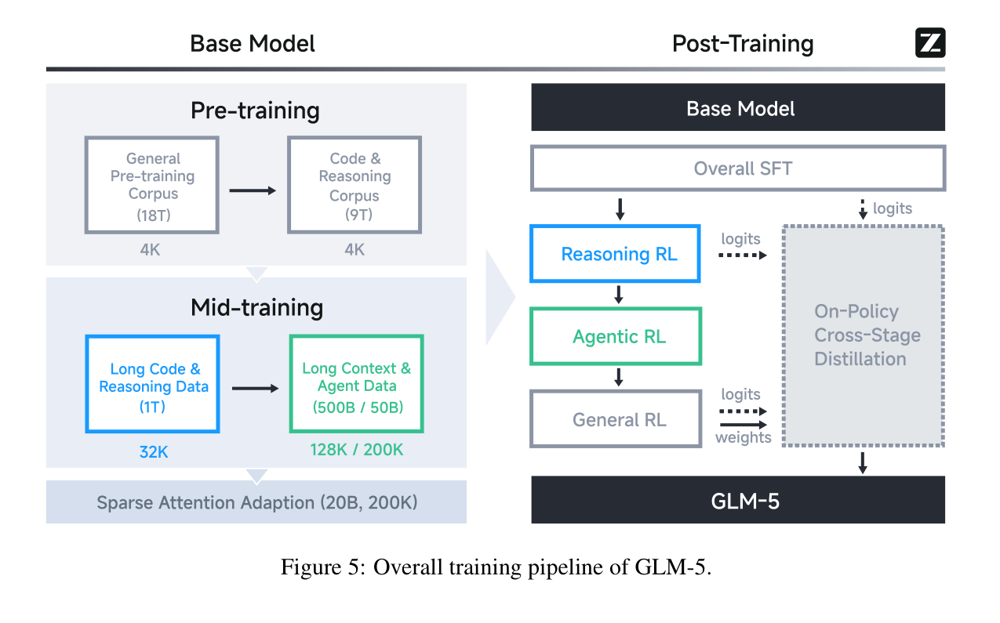
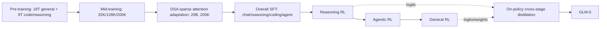
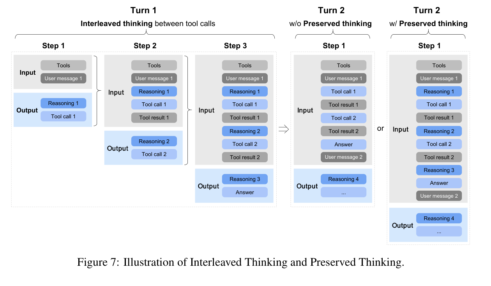
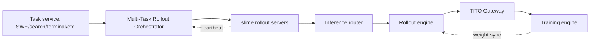
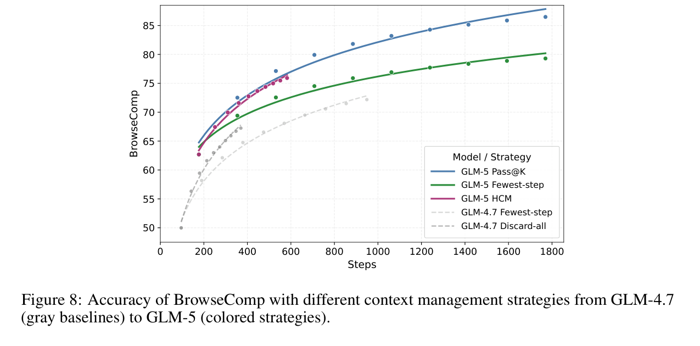
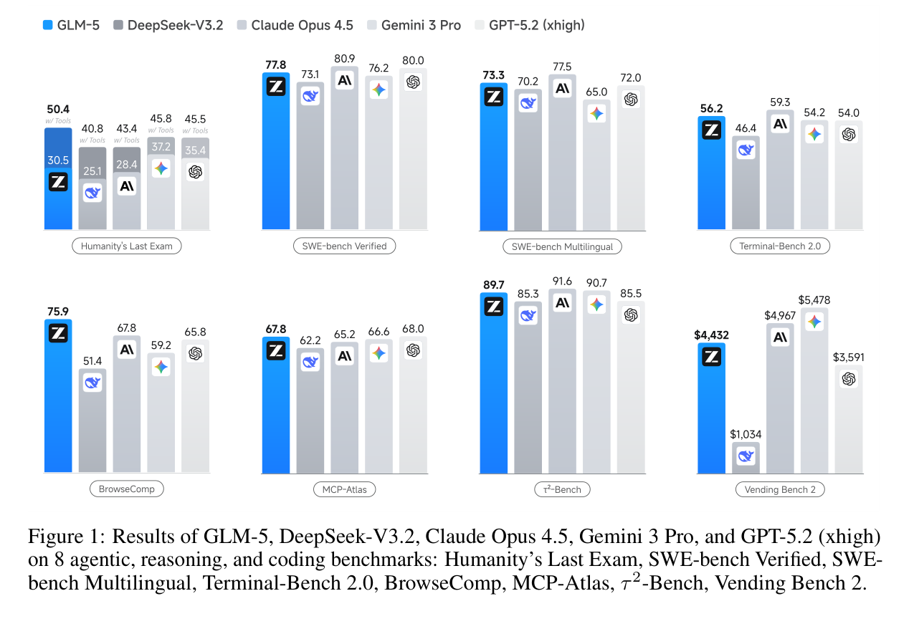
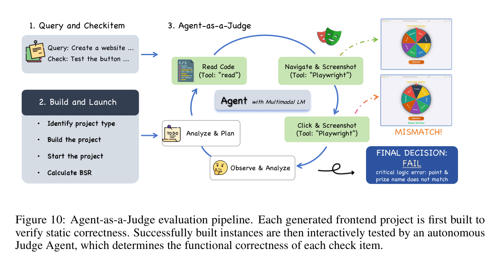

# GLM-5: from Vibe Coding to Agentic Engineering 学习笔记

> 来源：`d:\Users\文献\GLM-5-from Vibe Coding to Agentic Engineering.pdf`
> 论文/报告：GLM-5 Team, Zhipu AI & Tsinghua University, arXiv:2602.15763v2, 2026-02-24
> 页数：40 页
> 主题：面向 agentic engineering 的开放权重 MoE 大模型、稀疏注意力、异步 RL、真实软件工程评测

## 1. 一句话概括

GLM-5 试图把模型从“能在用户提示下写代码”的 vibe coding 推进到“能长期规划、调用工具、修改真实工程并自我迭代”的 agentic engineering，其核心路线是用 DSA 降低长上下文成本，用更大 MoE 与更长训练上下文提升基础能力，再用异步 agent RL、可执行环境和自动化评测强化真实工程能力。

## 2. 核心结论

- GLM-5 是 744B 总参数、40B 激活参数的 MoE 模型，相比 GLM-4.5 扩大总参数和训练 token 预算，面向 200K 上下文和长程 agent 任务设计。
- DSA 是效率主线：用内容相关的 top-k 稀疏注意力替代密集长上下文注意力，在报告中宣称长序列注意力计算约降低 1.5-2x，同时保持接近 MLA 的长上下文效果。
- Post-training 的重点从单轮对齐转向多阶段能力保持：SFT -> Reasoning RL -> Agentic RL -> General RL -> On-Policy Cross-Stage Distillation。
- Agentic RL 的系统难点不是单个 loss，而是长尾 rollout、异步 off-policy、工具环境稳定性、token 对齐、KV cache 复用和故障恢复。
- 评测上，GLM-5 在开放模型中明显领先，尤其是 BrowseComp、SWE-bench Multilingual、Terminal-Bench、repo exploration 等 agent/coding 任务；但在端到端 frontend ISR、长链工程任务、SWE-rebench 等场景仍落后于最强闭源模型。

## 3. 论文结构地图

| 部分 | 内容 | 学习重点 |
| --- | --- | --- |
| Introduction | ARC 能力、vibe coding 到 agentic engineering 的动机 | 为什么静态 benchmark 不够 |
| Pre-Training | MoE 架构、MLA/Muon Split、MTP、DSA、数据与 200K mid-training | 长上下文效率和基础能力扩展 |
| Training Infrastructure | 显存、并行、Muon 通信、activation offload、INT4 QAT | 大模型训练工程 |
| Post-Training | SFT、Reasoning RL、Agentic RL、General RL、跨阶段蒸馏 | 多目标 RL 与能力保持 |
| slime Framework | rollout 定制、HTTP server、tail latency、PD disaggregation、heartbeat | RL 系统吞吐和鲁棒性 |
| Agentic Engineering | SWE/terminal/search/slide 环境、context management | 可验证 agent 环境构造 |
| Chinese Chip Adaptation | W4A8、融合 kernel、vLLM/SGLang 适配 | 国产芯片部署路径 |
| Evaluation | ARC、CC-Bench-V2、SWE-rebench、真实通用能力 | 开放模型与闭源模型差距 |

## 4. 整体技术路线

这条路线的关键不是单点能力提升，而是把成本、上下文、工程环境、RL 稳定性和能力保持串成一个闭环：先让 base model 能处理长上下文和代码，再用可执行环境产生 agent 轨迹，最后用异步 RL 与跨阶段蒸馏尽量避免“强化一种能力、遗忘另一种能力”。

## 5. 架构与预训练

### 5.1 模型规格

| 项目 | GLM-4.5 | GLM-5 |
| --- | ---: | ---: |
| Total parameters | 355B | 744B |
| Activated parameters | 32B | 40B |
| Dense layers | 3 | 3 |
| MoE layers | 89 | 75 |
| MTP layers | 1 | 1 |
| Hidden dim | 5120 | 6144 |
| MoE intermediate dim | 1536 | 2048 |
| Attention heads | 96 | 64 |
| Indexer attention heads | - | 32 |
| Experts total / routed / shared | 160 / 8 / 1 | 256 / 8 / 1 |
| Vocabulary size | 151,552 | 154,880 |

正文中说 GLM-5 将层数减少到 80 以降低 expert parallelism 通信；附录表按 dense/MoE 层列出 3/75。读这类系统报告时要同时保留正文描述和附录表，因为二者可能采用不同统计口径。

### 5.2 MLA、Muon Split 与 MTP

MLA 用较小的 latent KV cache 省显存并加速长上下文，但报告发现原始 MLA 在 Muon optimizer 下不如 GQA-8。GLM-5 的修正是 Muon Split：把多头 query/key/value 的 up-projection 矩阵按 head 切成更小矩阵，再分别做矩阵正交化，让不同 attention head 的投影权重能以不同尺度更新。

MTP 用于 speculative decoding。论文认为只训练单个 MTP layer 但推理预测多个 token 会带来 train-inference discrepancy，因此训练时共享 3 个 MTP layer 的参数，在不增加 draft model 内存的情况下提升接受长度。报告中的私有 prompt 集上，GLM-5 accept length 为 2.76，高于 DeepSeek-V3.2 的 2.55。

### 5.3 DSA: DeepSeek Sparse Attention

DSA 的目标是把长上下文注意力从密集计算变成内容相关的稀疏选择。密集注意力随序列长度 $L$ 的复杂度是：

$$
O(L^2)
$$

DSA 的学习化理解是：对每个 query 不再看全部 KV，而是由 indexer 检索 top-k 相关 KV，再只在这些位置上做 attention。若忽略 indexer 代价，可理解为从 $O(L^2)$ 降到接近：

$$
O(Lk), \quad k \ll L
$$

报告强调 DSA 不像固定 sliding window 那样提前丢弃长程依赖，而是由 token 内容决定稀疏连接。GLM-5 的 DSA 迁移不是从零训练，而是在 dense/MLA base model 后做 continued pre-training：

- Warmup：1000 steps，每步 14 条 202,752 token 序列，最大学习率 $5e^{-3}$。
- Sparse adaptation：沿用 mid-training 数据和超参，训练 20B tokens。
- RL 阶段：使用 deterministic `torch.topk` 以避免 DSA indexer token selection 的训练/推理不一致，并默认冻结 indexer 参数。

DSA 与其他高效注意力变体的对比结论是：SWA/GDN/SimpleGDN 等方法在 RULER、RepoQA 等细粒度检索任务上存在信息损失，而 DSA 被报告为“lossless by construction”，可应用到所有层且不明显损害质量。

### 5.4 数据与上下文扩展

Base model 的训练 token 预算约 28.5T。Figure 5 给出的粗粒度阶段是：

| 阶段 | 数据/上下文 | 规模 |
| --- | --- | ---: |
| General pre-training corpus | 4K | 18T |
| Code & reasoning corpus | 4K | 9T |
| Long code & reasoning data | 32K | 1T |
| Long context & agent data | 128K / 200K | 500B / 50B |
| Sparse attention adaptation | 200K | 20B |

软件工程数据把 repo-level code files、commit diffs、GitHub issues、PRs 和相关源码拼接成统一序列。GLM-5 放宽 repo 级过滤、加强 issue 级质量过滤，得到约 1000 万 issue-PR pair，issue-PR 部分约 160B unique tokens。

## 6. 训练基础设施

训练系统的重点是把大 MoE、长序列、Muon、MTP 和输出层 loss 的峰值显存压下去。

| 机制 | 解决的问题 | 核心做法 |
| --- | --- | --- |
| Flexible MTP placement | MTP 模块造成 pipeline stage 显存不平衡 | MTP output 与 main output 同 stage 共享参数，embedding/transformer 放前一 stage |
| Pipeline ZeRO2 gradient sharding | 每个 pipeline rank 保留完整 gradient buffer 过重 | 按 DP rank shard gradient，并用 double buffering 只保留两个 full accumulation buffer |
| Zero-redundant Muon communication | Muon all-gather 全参数导致瞬时显存和通信冗余 | 只 all-gather 本 rank 拥有的 shard，并 overlap communication/computation |
| Activation offloading | pipeline warmup 让 activation 生命周期变长 | layer 粒度 offload 到 host memory，backward 前 reload |
| Sequence-chunked output projection | 输出投影和 CE loss 峰值显存大 | 按 sequence chunk 计算投影和 loss，释放后继续 |
| Efficient long-sequence training | 长序列引起 DP/PP 负载不均 | workload-aware reordering、attention redistribution、动态 context parallel group |
| INT4 QAT | 低精度推理精度损失 | SFT 阶段做 INT4 QAT，训练与离线量化 kernel bitwise-identical |

## 7. Post-Training

### 7.1 SFT

SFT 数据覆盖三类：

- General Chat：问答、写作、角色扮演、翻译、多轮对话、长上下文。
- Reasoning：数学、编程、科学推理。
- Coding & Agent：前后端工程代码、工具调用、coding agent、search agent、通用 agent。

GLM-5 在 SFT 中把最大上下文扩到 202,752 tokens，并引入三种 thinking 行为：

| Thinking 类型 | 作用 |
| --- | --- |
| Interleaved Thinking | 每次回复和工具调用前都思考，提高工具链任务质量 |
| Preserved Thinking | 多轮 coding agent 场景保留历史 thinking blocks，减少重复推理和不一致 |
| Turn-level Thinking | 每轮可开关思考，在延迟/成本和质量之间切换 |

### 7.2 Reasoning RL

Reasoning RL 建在 GRPO 与 IcePop 上，显式区分用于采样的 inference policy 和用于更新的 training policy。论文给出的 loss 可整理为：

$$
L(\theta) =
-\mathbb{E}_{x \sim D, \{y_i\}_{i=1}^{G} \sim \pi^{infer}_{\theta_{old}}(\cdot|x)}
\left[
\frac{1}{G}\sum_{i=1}^{G}\frac{1}{|y_i|}\sum_{t=1}^{|y_i|}
pop(\rho_{i,t}, 1/\beta, \beta)
\cdot
\min\left(
r_{i,t}\hat{A}_{i,t},
clip(r_{i,t}, 1-\epsilon_{low}, 1+\epsilon_{high})\hat{A}_{i,t}
\right)
\right]
$$

其中 mismatch ratio 为：

$$
\rho_{i,t} =
\frac{
\pi^{train}_{\theta_{old}}(y_{i,t}|x,y_{i,<t})
}{
\pi^{infer}_{\theta_{old}}(y_{i,t}|x,y_{i,<t})
}
$$

IcePop 的 pop 操作是：

$$
pop(\rho_{i,t}, 1/\beta, \beta)=
\begin{cases}
\rho_{i,t}, & 1/\beta \le \rho_{i,t} \le \beta \\
0, & otherwise
\end{cases}
$$

PPO-style importance ratio 与 group-normalized advantage 为：

$$
r_{i,t} =
\frac{
\pi^{train}_{\theta}(y_{i,t}|x,y_{i,<t})
}{
\pi^{train}_{\theta_{old}}(y_{i,t}|x,y_{i,<t})
},
\quad
\hat{A}_{i,t} =
\frac{R_i - mean(R_1,\dots,R_G)}{std(R_1,\dots,R_G)}
$$

报告超参：$\beta=2$，$\epsilon_{low}=0.2$，$\epsilon_{high}=0.28$，group size 32，batch size 32。

### 7.3 Agentic RL

Agentic RL 的核心问题是长程 agent rollout 的时间极不均衡，naive synchronous RL 会让 GPU 等待最慢样本。GLM-5 的做法是完全异步、训练引擎和推理引擎解耦：推理引擎连续产生轨迹，达到阈值后发送给训练引擎更新；训练引擎每 $K$ 个梯度更新把权重同步回推理引擎。

论文给出的 group-wise objective 是：

$$
L(\theta) =
\mathbb{E}_{x \sim D}
\left[
\frac{1}{K}\sum_{i=1}^{K}(r(x,y_i)-\bar{r}(x))
\right],
\quad
\bar{r}(x)=\frac{1}{K}\sum_{i=1}^{K}r(x,y_i)
$$

注意：论文同时说明只有 model-generated tokens 参与优化，environment feedback 不参与 loss 计算。这里的公式更像报告级简写，读者需要把它放在 group-wise policy optimization 的上下文里理解。

### 7.4 异步稳定性机制

| 机制 | 目的 | 关键点 |
| --- | --- | --- |
| Multi-Task Rollout Orchestrator | 多任务 agent RL 统一调度 | 每个任务作为独立 microservice 注册，统一 message-list trajectory，支持超过 1k concurrent rollouts |
| TITO Gateway | 消除重分词 mismatch | rollout 输出 token ids + metadata，训练侧直接消费 token stream |
| Direct double-sided importance sampling | 控制 off-policy bias | 用 rollout logprob 作为 behavior proxy，不保存历史 policy checkpoint |
| Stale sample dropping | 丢弃过旧轨迹 | 记录 rollout model version，若 $w' - w_0 > \tau$ 则丢弃 |
| Environment failure filtering | 避免环境崩溃污染 reward | 按失败原因过滤；group 不完整时重复有效样本或丢弃整组 |
| DP-aware routing | 多轮 agent KV cache 复用 | 同一 rollout 固定路由到同一 DP rank，减少重复 prefill |

Direct double-sided importance sampling 的 token-level clipping 公式是：

$$
L(\theta)=\mathbb{E}_t
\left[
f(r_t(\theta), \epsilon_l, \epsilon_h)\hat{A}_t
\log \pi_\theta(a_t|s_t)
\right]
$$

$$
r_t(\theta)=
\exp\left(
\log \pi_\theta(a_t|s_t)
-
\log \pi_{rollout}(a_t|s_t)
\right)
$$

$$
f(x;\epsilon_l,\epsilon_h)=
\begin{cases}
x, & 1-\epsilon_l < x < 1+\epsilon_h \\
0, & otherwise
\end{cases}
$$

这组公式的直觉：只学习和当前 policy 不太偏离的 token；偏离过大的 token 直接 mask，牺牲一部分样本利用率换稳定性。

### 7.5 General RL 与跨阶段蒸馏

General RL 优化三类目标：基础正确性、情绪/表达体验、任务特定质量。奖励系统混合 rule-based reward、ORM 和 GRM，以平衡可解释性、低方差和抗 reward hacking 能力。

多阶段 RL 会带来能力回退，因此 GLM-5 最后做 On-Policy Cross-Stage Distillation。教师来自前面阶段的最终 checkpoint，prompt 从对应阶段的 RL 数据集中采样混合。论文将 Eq. 1 中 advantage 替换为：

$$
\hat{A}_{i,t}=
sg\left[
\log
\frac{
\pi^{infer}_{\theta_{teacher}}(y_{i,t}|x,y_{i,<t})
}{
\pi^{train}_{\theta}(y_{i,t}|x,y_{i,<t})
}
\right]
$$

这里 `sg` 是 stop-gradient。直觉上，模型不再靠采样 reward 估计 advantage，而是用 teacher 和当前 policy 的 log probability gap 作为恢复早期能力的信号。

## 8. slime RL 基础设施

slime 是 GLM-5 post-training 的统一 RL 基础设施。它的关键价值在于支持自由定制 rollout，同时把训练后端、server-based rollout、inference router 和任务环境解耦。

系统层面的重要优化：

- No-queue serving：多节点推理部署提供足够 KV cache，减少 bursty rollout queueing。
- FP8 rollout + MTP：降低 per-token latency，尤其改善小 batch、长尾样本。
- PD disaggregation：prefill 和 decode 分资源执行，避免长 prefix prefill 干扰 decode。
- Heartbeat fault tolerance：rollout server 定期 heartbeat，不健康 server 被 router 下线，重试流量自动避开。

## 9. Agentic Engineering 环境

论文把 vibe coding 定义为“人提示 AI 写代码”，agentic engineering 则是“AI agent 自己规划、实现、迭代”。这需要可验证、可执行的训练环境，而不是只靠文本偏好数据。

### 9.1 SWE 环境

SWE 环境来自真实 issue-PR pairs，覆盖 bug fixing、feature implementation、refactoring 等任务。环境构建基于 RepoLaunch，自动分析安装依赖、生成测试命令，并用 LLM 生成 log parser，从测试输出中抽取 Fail-to-Pass 和 Pass-to-Pass 用例。最终构造超过 10k 个可验证环境，覆盖 Python、Java、Go、C、C++、JavaScript、TypeScript、PHP、Ruby 等 9 种语言。

### 9.2 Terminal 环境

Terminal task 有两条生成路径：

- Seed data synthesis：从真实 SWE 和 terminal computer-use 场景出发，生成 task draft -> construction agent 实例化为 Harbor 格式 -> refine agent 按 rubric 迭代修复。
- Web corpus synthesis：筛选代码相关网页，让 construction agent 同时生成任务并运行 Harbor validation，自验证通过才进入数据集。

报告称 Docker construction accuracy 超过 90%。

### 9.3 Search 环境与上下文管理

Search task 通过 Web Knowledge Graph 构造多跳 QA。流程是：早期 search agent 轨迹收集 URL，保留超过 200 万高信息网页；LLM 做实体识别、关系抽取、图更新与一致性校正；从低/中频实体扩展多跳子图，再生成高难问题。

Context management 的关键观察：超长交互历史会让 search agent 性能下降，尤其超过 100k tokens。GLM-5 使用两级策略：

- Keep-recent-k：只保留最近 $k=5$ 轮的完整 observation，旧 observation 替换为“Tool result is omitted to save tokens”。
- Hierarchical Context Management：当总上下文超过阈值 $T=32k$，丢弃整段工具调用历史并重新开始，同时继续使用 keep-recent。

报告中 BrowseComp 从无 keep-recent 的 55.3% 提升到 62.0%，结合 HCM 后最终到 75.9。

### 9.4 Slide Generation

Slide generation 被建成 HTML 结构化生成任务，用 RL + rejection sampling + mask fine-tuning 自改进。奖励分三层：

| 层级 | 评价对象 | 例子 |
| --- | --- | --- |
| Level-1 | 静态 markup attributes | 位置、间距、颜色、字体、饱和度、HTML 可解析性 |
| Level-2 | runtime rendering properties | DOM 尺寸、bounding box、布局几何属性 |
| Level-3 | visual perceptual features | 异常留白、视觉构图、审美一致性 |

报告提到两个 reward hacking 例子：硬截断长文本、过度操纵间距。它们通过 renderer 修复和更 grounded 的 runtime attribute 评价缓解。结果上，16:9 严格合规页面从 40% 到 92%；相对 GLM-4.5，人评 win rate 为内容质量 60%、布局合理性 57.5%、视觉审美 65%、总体 67.5%。

## 10. 国产芯片适配

GLM-5 从一开始就适配中国 GPU/NPU 生态，覆盖 Huawei Ascend、Moore Threads、Hygon、Cambricon、Kunlunxin、MetaX、Enflame。论文以 Ascend Atlas 为案例，核心是三件事：

| 方向 | 做法 |
| --- | --- |
| Mixed-Precision W4A8 | Attention/MLP 用 W8A8，MoE experts 用 W4A8；使用 QuaRot 做 outlier suppression，Flex_AWQ_SSZ 做 scaling calibration |
| Fusion kernels | Lightning Indexer 融合 score/ReLU/TopK；Sparse Flash Attention 并行做 TopK token selection 与 sparse attention；MLAPO 融合 13 个 MLA preprocessing 小算子 |
| Inference engine | vLLM-Ascend 和 SGLang 适配；D2H sampling copy 与 decode 准备 overlap；RadixCache/Prefix Cache；Attention DP + MoE EP + FlashComm；MTP 提高 NPU 计算密度 |

报告声称这些优化让单个国产节点在长序列场景达到可比双 GPU 国际集群的性能，并降低 50% 部署成本。

## 11. 评测结果

### 11.1 ARC benchmark

| 任务 | GLM-5 | 观察 |
| --- | ---: | --- |
| HLE / HLE with tools | 30.5 / 50.4 | with-tools 明显强于 GLM-4.7、DeepSeek-V3.2 和部分闭源模型 |
| SWE-bench Verified | 77.8 | 开源模型 SOTA，接近 Claude Opus 4.5/GPT-5.2 |
| SWE-bench Multilingual | 73.3 | 高于 Gemini 3 Pro 和 GPT-5.2 |
| Terminal-Bench 2.0 | 56.2 / 60.7 verified | 修复歧义指令后接近或超过 Claude Opus 4.5 |
| CyberGym | 43.2 | 大幅超过 GLM-4.7，但低于 Claude Opus 4.5 |
| BrowseComp / with context management | 62.0 / 75.9 | frontier 中最突出项目之一 |
| BrowseComp-ZH | 72.7 | 高于 Claude Opus 4.5 和 Gemini 3 Pro |
| τ²-Bench | 89.7 | 与 Claude/Gemini 接近 |
| MCP-Atlas public set | 67.8 | 接近 GPT-5.2，略高于 Claude/Gemini |
| Tool-Decathlon | 39.2 | 低于 Claude Opus 4.5 和 GPT-5.2 |
| Vending-Bench 2 | $4,432 | 开源模型中强，低于 Claude/Gemini |
| GDPval-AA Elo | 1,409 | 高于 Claude Opus 4.5，低于 GPT-5.2 |

### 11.2 CC-Bench-V2: 真实 agentic engineering

CC-Bench-V2 覆盖 frontend、backend、long-horizon。它尽量减少人工标注，使用 unit tests 和 Agent-as-a-Judge。Frontend evaluation 的两阶段是：先 build/run 做静态验证，再让 GUI judge agent 通过 Playwright 交互测试 check items。

| 子任务 | GLM-5 | GLM-4.7 | Claude Opus 4.5 | 读法 |
| --- | ---: | ---: | ---: | --- |
| Frontend HTML ISR / CSR | 38.9 / 76.3 | 35.4 / 64.9 | 52.2 / 82.2 | 细项完成率接近，整任务成功率差距明显 |
| Frontend React ISR / CSR | 34.6 / 71.0 | 17.2 / 49.4 | 39.7 / 70.7 | CSR 略高于 Claude，但 ISR 仍低 |
| Frontend Vue ISR / CSR | 32.7 / 77.1 | 24.5 / 53.8 | 46.9 / 74.3 | CSR 高，端到端完成仍不足 |
| Build React/Vue/Svelte/Next.js BSR | 100/100/100/95 | 65/70/60/70 | 95/100/90/80 | GLM-5 build 稳定性很强 |
| Backend Pass@1 | 25.8 | 19.6 | 26.9 | 接近 Claude Opus 4.5 |
| Repo Exploration Pass@1 | 65.6 | 47.8 | 64.5 | GLM-5 略高于 Claude |
| Chained Tasks Pass@1 | 52.3 | 43.0 | 61.6 | 长链任务仍有明显差距 |

Agent-as-a-Judge 的可靠性验证：130 个 check-item 上与人类专家一致率 94%；8 个 frontier models 的自动排序与专家排序 Spearman 相关 85.7%。这说明它比纯静态测试更贴近 frontend 真实体验，但仍依赖 judge agent 和测试设计质量。

### 11.3 SWE-rebench

SWE-rebench 用持续挖掘的新 GitHub issue-fixing 任务缓解 SWE-bench Verified 的公开污染和时间过旧问题。2026 年 1 月官方结果中：

| Model | Resolved Rate | Pass@5 |
| --- | ---: | ---: |
| Claude Opus 4.6 | 52.9% | 70.8% |
| GPT-5.2 xhigh | 51.7% | 58.3% |
| Claude Sonnet 4.5 | 47.1% | 60.4% |
| Gemini 3 Pro | 46.7% | 58.3% |
| Claude Opus 4.5 | 43.8% | 58.3% |
| GLM-5 | 42.1% | 50.0% |
| GLM-4.7 | 41.3% | 56.3% |
| Kimi K2.5 | 37.9% | 50.0% |

GLM-5 能泛化到新 SWE 任务，但相对最强闭源模型还有明显空间。

### 11.4 真实通用能力

报告还评估了机器翻译、多语言对话、指令遵循、世界知识、工具调用五类真实用户高频能力。Figure 11 显示 GLM-5 相比 GLM-4.7 均有提升，尤其是 tool calling badcase 从 60.8 提升到 95.8。

## 12. 局限与风险

这些不是论文单独列出的限制，而是基于报告内容的阅读笔记：

- 许多关键评测是内部 benchmark 或内部数据集，如 CC-Bench-V2、ZMultiTransBench、IF-Badcase、ToolCall-Badcase，复现门槛较高。
- 多个自动评测依赖强闭源 judge 或 agent harness，如 GPT-4.1、o3-mini、Gemini 3 Pro、Claude Code/Sonnet 4.5；judge bias 会影响结论。
- 异步 RL 用 logprob proxy、staleness dropping 和 double-sided clipping 控制 off-policy，但这仍是工程折中，不等于完全无偏。
- DSA 在 RL 中对 top-k determinism 很敏感；报告说非 deterministic CUDA/TileLang top-k 会导致 RL 几步后退化和 entropy 急降。
- Frontend 的 CSR 很强但 ISR 有差距，说明模型能满足很多局部需求，但完整交付仍易在少数关键点失败。
- Long-horizon chained tasks 明显落后 Claude Opus 4.5，论文也指出错误会在任务链中累积，长期一致性和自纠错仍是开放问题。
- 国产芯片适配以 Ascend case study 为主，跨平台细节和可公开复现实测仍有限。

## 13. 个人学习笔记

- 这篇报告的核心价值是“系统栈视角”：模型结构、训练数据、RL 算法、rollout 系统、任务环境、推理部署、评测体系都服务于 agentic engineering。
- DSA 值得重点复习。它不只是稀疏注意力，而是要求训练、推理、RL 的 top-k selection 一致；否则 RL 稳定性会崩。
- Agentic RL 的关键工程对象是 trajectory，而不是普通文本样本。TITO、rollout version、environment failure reason、DP rank affinity 都是围绕 trajectory 的一致性和可学习性设计的。
- CC-Bench-V2 的 frontend 评测思路有借鉴价值：build 是必要但不充分的静态门槛，交互式 judge 可以捕获视觉与状态机错误。
- 从 SWE-rebench 和 chained tasks 看，单点 coding benchmark 的高分不等价于持续工程能力；真实 agent 需要跨步骤保持意图、状态和回归测试意识。

## 14. 复习清单

- [ ] GLM-5 为什么要从 GLM-4.5 的 355B/32B active 扩到 744B/40B active？
- [ ] MLA 在 Muon optimizer 下出现什么问题？Muon Split 怎么解决？
- [ ] DSA 与 SWA/GDN 的根本差异是什么？
- [ ] 为什么 DSA RL 必须使用 deterministic top-k，并默认冻结 indexer？
- [ ] Interleaved Thinking 和 Preserved Thinking 分别解决什么 agent 问题？
- [ ] Reasoning RL 中 $\rho_{i,t}$、$r_{i,t}$、$\hat{A}_{i,t}$ 分别表示什么？
- [ ] 异步 Agentic RL 为什么会产生 off-policy 问题？
- [ ] TITO Gateway 为什么比 text-in-text-out 更适合 RL？
- [ ] Direct double-sided importance sampling 怎样过滤极端偏离 token？
- [ ] slime 的 PD disaggregation 为什么能降低 multi-turn RL tail latency？
- [ ] Search agent 的 Keep-recent-k 与 HCM 如何控制上下文膨胀？
- [ ] CC-Bench-V2 的 BSR、ISR、CSR 分别衡量什么？
- [ ] 为什么 GLM-5 frontend CSR 高但 ISR 仍落后 Claude？
- [ ] SWE-rebench 相比 SWE-bench Verified 解决了什么评测问题？

## 15. Glossary

| 术语 | 含义 |
| --- | --- |
| ARC | Agentic, Reasoning, Coding，GLM 系列强调的三类核心能力 |
| Agentic Engineering | AI agent 自主规划、实现、测试、迭代真实工程任务 |
| MLA | Multi-latent Attention，用 latent KV 降低长上下文 memory/compute |
| DSA | DeepSeek Sparse Attention，内容相关 top-k 稀疏注意力 |
| MTP | Multi-Token Prediction，用于 speculative decoding |
| Muon Split | 对 MLA up-projection 按 head 分块做 Muon orthogonalization |
| GRPO | Group Relative Policy Optimization，用同组样本 reward 归一化 advantage |
| IcePop | 通过 mismatch ratio 抑制训练/推理分布偏差过大的样本 |
| TITO | Token-in-Token-out，训练直接消费 rollout token ids 和 metadata |
| PD disaggregation | Prefill 和 Decode 分离部署，避免长 prefix 干扰 decode |
| HCM | Hierarchical Context Management，keep-recent 与 discard-all 结合的 search context 管理 |
| BSR | Build Success Rate，项目能成功初始化/构建/运行的比例 |
| ISR | Instance Success Rate，完整任务所有规格都通过的比例 |
| CSR | Check-item Success Rate，细粒度需求项通过比例 |
| F2P/P2P | Fail-to-Pass / Pass-to-Pass，SWE 环境中的测试状态指标 |
