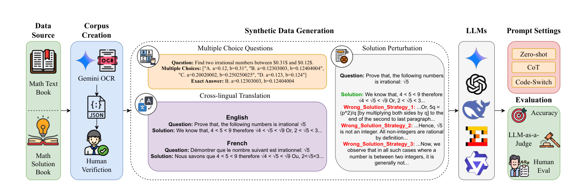
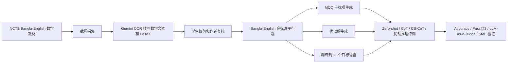
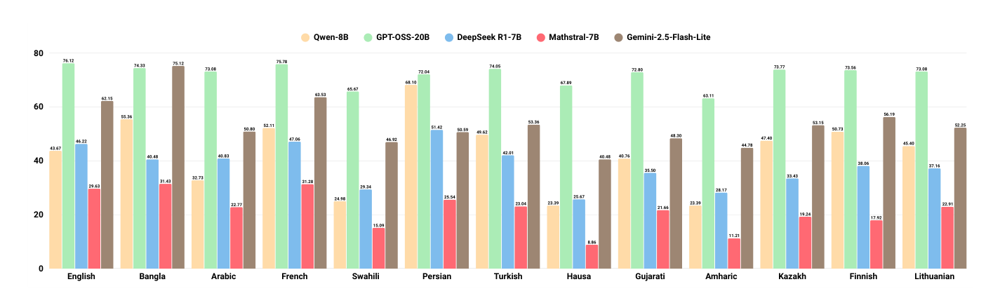
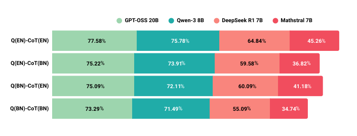

# MathMist 学习笔记

> 来源：`D:\Users\文献\MathMist-A Parallel Multilingual Benchmark Dataset for Mathematical Problem Solving and Reasoning.pdf`
> 论文：MathMist: A Parallel Multilingual Benchmark Dataset for Mathematical Problem Solving and Reasoning
> 重点：多语种数学推理基准、平行语料构造、代码切换 CoT、扰动推理、LLM 评测

## 1. 一句话概括

MathMist 是一个面向 LLM 多语种数学推理的平行基准：从 Bangla-English 金标准数学题出发，扩展到 13 种语言，并加入 MCQ（多项选择题）、代码切换 CoT 和错误扰动任务，用来观察模型在语言迁移、推理步骤和低资源语言上的稳定性。

## 2. 核心结论

- 数据集包含 1,445 个 Bangla-English 平行数学题，扩展到 13 种语言后形成 18,785 个问题实例，加上 2,266 个 MCQ 和 8,670 个扰动解，总计 29,721 个 artifacts。
- 基准不只看最终答案，还测试模型能否在跨语言、代码切换和错误解诊断场景中保持推理一致性。
- CoT 通常提升准确率，尤其是 Qwen、DeepSeek、Mathstral 等模型；但强模型 GPT-OSS-20B 在 zero-shot 和 CoT 间更稳定。
- 代码切换会带来明确性能损失，问题语言和 CoT 语言不一致时，较小模型下降更明显。
- 错误检测和错误诊断不是同一能力：很多模型能判断“有错”，但难以定位具体错误类型或错误步骤。
- 低资源语言仍然是主要薄弱点，性能差距与预训练覆盖、对齐质量、语言脚本和数学表达迁移能力有关。

## 3. 论文结构速览

| 部分 | 页码 | 要点 |
|---|---:|---|
| Abstract / Introduction | 1-2 | 提出 MathMist，说明英语中心数学基准不足，列出数据规模和任务类型 |
| Related Work | 2-3 | 对比 Bangla、低资源、多语种数学推理数据集 |
| Corpus Creation | 3-5 | 数据来源、OCR、人工校验、MCQ、扰动解、多语种翻译 |
| Experimental Setup | 5-6 | 模型、指标、LLM-as-a-Judge、prompt 技术 |
| Results & Analysis | 6-9 | BN-EN zero-shot/CoT、13 语种表现、MCQ、代码切换、扰动推理 |
| Discussion / Conclusion | 9-10 | 归纳模型行为和低资源语言问题 |
| Appendix | 13-27 | prompt 模板、语言统计、Qwen scaling、完整分类结果、CoT 语言混杂统计 |

## 4. 整体技术路线

这条路线的核心是先构造高质量 Bangla-English 平行数据，再在保持数学等价的前提下横向扩展任务形态和语言覆盖。

## 5. 数据集设计

### 5.1 数据来源与清洗

| 项目 | 信息 |
|---|---|
| 原始来源 | Bangladesh NCTB secondary school mathematics books, 2018-2019 学年教材 |
| 初始金标准 | 1,445 个 Bangla-English 平行题，共 2,890 个 Bangla/English artifacts |
| 采集方式 | 8 名本科生截图采集题目和解答 |
| OCR | Gemini 2.0 Pro 转写 Bangla、English、数学表达式和 LaTeX |
| 人工校验 | 学生校验 OCR，第三名学生检查平行对齐，5 位作者最终复核 |
| 剔除范围 | 需要图形推理的章节被排除，保留不依赖插图即可作答的问题 |

论文强调只保留不需要图形的题目，原因是希望评测对象集中在文本数学推理，而不是视觉几何理解。

### 5.2 语种覆盖

| 资源水平 | 语言 |
|---|---|
| 高资源 | English, French, Arabic |
| 中等资源 | Turkish, Persian, Swahili, Gujarati, Finnish, Lithuanian |
| 低资源 | Bangla, Hausa, Amharic, Kazakh |

13 种语言横跨 Latin、Arabic、Bangla、Gujarati、Ethiopic、Cyrillic 等脚本，也覆盖 Indo-European、Semitic、Bantu、Turkic、Uralic、Afroasiatic 等语系。

### 5.3 Corpus 规模

| 类型 | 数量 |
|---|---:|
| 每种语言问题数 | 1,445 |
| 13 语种问题实例 | 18,785 |
| Bangla + English MCQ | 2,266 |
| Bangla + English 扰动解 | 8,670 |
| 总 artifacts | 29,721 |

按题型分布：

| 类别 | 数量 | 占比 |
|---|---:|---:|
| Numerical | 10,959 | 58.34% |
| Symbolic | 3,770 | 20.07% |
| Proof | 4,056 | 21.59% |

每种语言的分布相同，因此跨语言结果更接近控制变量实验。

## 6. 关键机制与公式

### 6.1 MCQ 干扰项生成

对于正确答案 $A$，论文从三类候选干扰项中采样 $k$ 个：

$$
D = \mathrm{sample}_k(D_{\mathrm{calc}} \cup D_{\mathrm{concept}} \cup D_{\mathrm{plaus}})
$$

采样权重满足：

$$
p_{\mathrm{calc}}, p_{\mathrm{concept}}, p_{\mathrm{plaus}} \ge 0,\quad
\sum p_{\cdot} = 1
$$

三类干扰项分别对应：

$$
D_{\mathrm{calc}} \ni \{A \pm 1,\ -A,\ 10A,\ A/10\}
$$

$$
D_{\mathrm{concept}} \ni \{f_{\mathrm{wrong}}(x)\mid f_{\mathrm{wrong}} \ne f_{\mathrm{true}}\}
$$

$$
D_{\mathrm{plaus}} \ni \{A+\delta,\ \mathrm{round}(A,r)\}
$$

其中：

- $D_{\mathrm{calc}}$：计算错误，如差一、符号错误、小数位错误。
- $D_{\mathrm{concept}}$：概念错误，如公式、单位或定理使用错误。
- $D_{\mathrm{plaus}}$：看起来合理但不正确的近似值。
- $V(D)=false$：自动验证器必须判定干扰项不等于正确答案。
- $|D-A|>\tau$：避免干扰项与答案过近导致数值歧义。

这使 MCQ 不是随机错误选项，而是针对模型常见数学错误构造的“有迷惑性错误”。

### 6.2 扰动推理

每个样本记为：

$$
(Q, S_{\mathrm{true}}, A)
$$

其中 $Q$ 是问题，$S_{\mathrm{true}}$ 是正确解答过程，$A$ 是最终答案。论文定义扰动策略集合：

$$
\Sigma = \{\sigma_1, \sigma_2, \sigma_3\}
$$

扰动解由策略作用在正确解上得到：

$$
\tilde{S} = \sigma_i(S_{\mathrm{true}})
$$

三类策略大致对应：

| 策略 | 注入错误 |
|---|---|
| $\sigma_1$ | 步骤遗漏、错误规则、错误因果 |
| $\sigma_2$ | 过度泛化、逻辑谬误 |
| $\sigma_3$ | 混合前面所有五类错误 |

关键约束是：扰动解要保持原解的语气和结构，但在相同位置嵌入等价错误。对 Bangla-English 平行语料，英文和 Bangla 版本需要保留相同错误类型和错误位置。

### 6.3 多语种翻译与验证

原始样本仍记为：

$$
(Q, S_{\mathrm{true}}, A)
$$

目标语言集合为：

$$
L=\{\mathrm{Arabic},\mathrm{French},\mathrm{Swahili},\mathrm{Persian},\mathrm{Turkish},\mathrm{Hausa},\mathrm{Gujarati},\mathrm{Amharic},\mathrm{Kazakh},\mathrm{Finnish},\mathrm{Lithuanian}\}
$$

对每种语言 $\ell$，翻译 agent $A_\ell$ 生成候选：

$$
(Q_\ell, S_\ell, A_\ell)
$$

再由 verifier $V_\ell$ 按四类标准检查：

$$
Q_{\mathrm{criteria}}=\{M,T,L,C\}
$$

其中：

- $M$：mathematical fidelity，数学忠实度。
- $T$：terminological correctness，术语正确性。
- $L$：language quality，语言质量。
- $C$：completeness，完整性。

若不满足标准，verifier 生成修正版：

$$
(\tilde{Q}_{\ell},\tilde{S}_{\ell},\tilde{A}_{\ell})
=V_{\ell}(Q_{\ell},S_{\ell},A_{\ell};Q,S_{\mathrm{true}},A)
$$

论文还使用 Google Translate、DeepL 和 SME back-translation 检查语义一致性。

### 6.4 LLM-as-a-Judge

自由形式答案和扰动诊断使用 Gemini 2.0 Flash-Lite 作为 judge，形式化为：

$$
J:(A_{\mathrm{llm}}, A_{\mathrm{gt}})\mapsto
\left(R,\left[\left\|v(A_{\mathrm{llm}})-v(A_{\mathrm{gt}})\right\|\le\epsilon\right]\right)
$$

其中：

- $A_{\mathrm{llm}}$：模型输出。
- $A_{\mathrm{gt}}$：标准答案。
- $v(\cdot)$：把答案转成真实数学值、表达式、命题或引用的 valuation function。
- $\epsilon$：可接受误差。
- $R$：judge 给出的判定理由。
- 方括号内为二值正确性判断，无法判定时保守计为错误。

SME 验证显示 LLM-as-a-Judge 与人类判断的一致率约为 91.39% 到 94.8%。

## 7. 实验设置

### 7.1 模型

| 模型 | 参数规模 | 类型 |
|---|---:|---|
| GPT-OSS-20B | 20B | open-source |
| Qwen-3 / Qwen-8B | 8B | open-source |
| DeepSeek R1-7B | 7B | open-source |
| Mathstral-7B | 7B | open-source |
| Gemini 2.5 Flash-Lite | N/A | proprietary |
| Phi-4 | 14B | MCQ 对比中使用 |

设置上，论文使用 temperature $T=1.0$，最大生成长度 32K tokens，并对支持的模型开启 thinking mode。

### 7.2 Prompt 设置

| 设置 | 目标 |
|---|---|
| Zero-shot | 不给示例，直接求解 |
| CoT | 要求模型逐步推理 |
| Code-Switched CoT | 问题语言和解题语言不同，例如英文题要求 Bangla CoT |
| Perturbed Reasoning | 给出含错误解答，要求检测和定位错误 |

CS-CoT 的关键点不是输入中自然混杂语言，而是强制模型跨语言理解问题并用另一种语言写推理过程。

### 7.3 指标

| 指标 | 用途 |
|---|---|
| Accuracy | MCQ 和可判定答案准确率 |
| Pass@3 | 三次独立尝试中至少一次解出 |
| Error Detection | 判断扰动解是否有错 |
| Error Identification | 定位或解释具体错误 |
| LLM-as-a-Judge score | 自由形式答案、等价性和扰动诊断评分 |

## 8. 主要实验结果

### 8.1 BN-EN zero-shot 与 CoT

| 模型 | Bangla Zero-shot | Bangla CoT | English Zero-shot | English CoT |
|---|---:|---:|---:|---:|
| GPT-OSS-20B | 74.33% | 75.22% | 76.12% | 77.58% |
| Qwen-3 8B | 55.36% | 72.11% | 43.67% | 75.78% |
| DeepSeek R1-7B | 40.48% | 60.90% | 46.23% | 64.84% |
| Mathstral-7B | 31.42% | 41.18% | 29.62% | 45.26% |
| Gemini 2.5 Flash-Lite | 75.09% | 71.38% | 62.15% | 71.63% |

观察：

- CoT 对 Qwen、DeepSeek、Mathstral 提升明显，尤其 Qwen 在 English 上从 43.67% 到 75.78%。
- GPT-OSS-20B 已经有较强 zero-shot 能力，CoT 只带来小幅提升。
- Gemini 在 Bangla zero-shot 很强，但 Bangla CoT 反而下降，论文将其视为可能依赖模式匹配而非稳定数学推理的信号。

### 8.2 13 语种整体表现

论文报告的跨语言整体模式：

| 模型 | 平均表现与方差特征 |
|---|---|
| GPT-OSS-20B | 最高且最稳定，$\mu \approx 72.11\%, \sigma \approx 3.83\%$ |
| Gemini 2.5 Flash-Lite | 中高水平，$\mu \approx 53.66\%$ |
| Qwen-8B | 中等表现但跨语言波动最大，$\mu \approx 43.81\%, \sigma \approx 13.49\%$ |
| DeepSeek R1-7B | 中等偏低，$\mu \approx 38.10\%$ |
| Mathstral-7B | 最弱，$\mu \approx 21.58\%, \sigma \approx 6.83\%$ |

结论是：数学专门化并不自动转化为多语种鲁棒性，广覆盖预训练和跨语言对齐更关键。

### 8.3 MCQ 结果

| 模型 | Bangla Overall | English Overall |
|---|---:|---:|
| GPT-OSS-20B | 88.97 | 90.20 |
| Phi-4 | 78.55 | 82.26 |
| Qwen-3 8B | 66.28 | 74.05 |
| DeepSeek R1-7B | 67.70 | 71.67 |
| Mathstral-7B | 41.39 | 48.01 |

MCQ 的整体准确率明显高于自由形式推理，因为答案空间被约束，格式鲁棒性和选项归一化降低了模型输出歧义。但这也意味着 MCQ 更适合评估“辨认正确答案”的能力，而不是完整推理生成能力。

### 8.4 代码切换 CoT

| 设置 | GPT-OSS-20B | Qwen-3 8B | DeepSeek R1-7B | Mathstral-7B |
|---|---:|---:|---:|---:|
| Q(EN)-CoT(EN) | 77.58% | 75.78% | 64.84% | 45.26% |
| Q(EN)-CoT(BN) | 75.22% | 73.91% | 59.58% | 36.82% |
| Q(BN)-CoT(EN) | 75.09% | 72.11% | 60.09% | 41.18% |
| Q(BN)-CoT(BN) | 73.29% | 71.49% | 55.09% | 34.74% |

解释：

- 问题语言和推理语言一致时效果最好。
- GPT-OSS-20B 下降最小，从 77.58% 到 73.29%。
- DeepSeek 和 Mathstral 下降更明显，说明较小或跨语言对齐不足的模型更依赖训练中高频语言路径。
- Appendix 的 CoT 语言统计显示，部分模型被要求用 Bangla 推理时仍会混入 English、Cyrillic、Chinese、Arabic、Greek、Japanese 等字符或 token，形成语言干扰。

### 8.5 扰动推理

扰动任务分成两步：

| 能力 | 含义 |
|---|---|
| Error Detection | 判断解答是否有错误 |
| Error Identification | 找到具体错误位置、错误类型或错误原因 |

论文的关键发现是，Error Detection 明显容易于 Error Identification。以 $\sigma_3$ 为例，多个错误叠加会形成更强的矛盾信号，因此检测准确率最高，但具体诊断仍然下降明显。

| 策略 | 现象 |
|---|---|
| $\sigma_1$ | 局部错误较隐蔽，诊断难度高 |
| $\sigma_2$ | 逻辑谬误和过度泛化需要更强抽象判断 |
| $\sigma_3$ | 多错误叠加更容易被检测，但不代表模型能解释所有错误 |

这说明“能发现错了”不能等价于“具备可解释数学审查能力”。

## 9. 讨论与局限

### 9.1 论文中的重要讨论

- Zero-shot 更偏向 symbolic/proof，CoT 对 numerical 问题帮助更明显。
- Qwen-3 从 0.6B 到 14B 的 scaling 缩小了 English-Bangla gap，并提升 proof 能力。
- Bangla CoT 是明显失败点，模型会产生混杂语言、过长无解输出、自我放弃和循环回溯。
- Gemini 的 English zero-shot 低于 Bangla zero-shot，也低于部分开源模型，论文认为这可能反映模式匹配与深层数学推理之间的差异。

### 9.2 作者列出的局限

- 主要使用 frozen models 和 zero-shot/CoT/CS-CoT/perturbed prompting，没有做监督微调。
- 可以加入 one-shot、few-shot、Atom of Thoughts、Program of Thoughts 等更强 prompt 或推理策略。
- 数据主要来自中学数学，未来可扩展到高中或更高层次数学。
- 可纳入更多 proprietary models，例如 GPT-5、Gemini-2.5 Pro、Claude-4 等。

### 9.3 阅读时需要注意

- 论文主体多处强调 13 种语言，但 conclusion 中出现“seven diverse languages”的表述，可能是写作残留或统计口径不一致；读结果时应以 Table 2、Figure 2 和 Appendix 的 13 语种统计为准。
- 扩展语种主要依赖 Gemini 翻译与 verifier 修正，虽然有 back-translation 和 SME 检查，但低资源语言的细粒度数学术语质量仍可能是潜在误差源。
- LLM-as-a-Judge 与 SME 一致率较高，但 judge 本身仍是模型，尤其在复杂等价、证明题和低资源语言上可能引入系统偏差。
- MCQ 结果较高不代表模型能生成完整可靠解答，受限答案空间会放大准确率。

## 10. 个人学习笔记

这篇论文的价值不在于提出新的数学求解算法，而在于把“多语种数学推理”拆成了更可测的几个维度：平行语料、题型、推理语言、错误扰动和诊断能力。相比只看最终答案，MathMist 更能揭示模型是否真正跨语言保持同一条数学推理链。

最值得借鉴的设计是扰动解任务。很多数学评测默认标准答案是唯一关注点，但实际教学和审题场景中，识别错误推理同样重要。MathMist 把错误类型、错误位置和平行语言一致性纳入构造流程，适合用来测试模型的数学审阅能力。

需要谨慎的是，数据扩展强依赖 LLM 翻译和 LLM judge。即使有 SME 参与，这类基准仍可能把某些翻译风格、prompt 模板或 judge 偏好固化进数据集。因此使用 MathMist 做模型排名时，应优先看相对趋势和失败模式，而不是只看一个总分。

## 11. 复习清单

- [ ] MathMist 为什么要从 Bangla-English 平行教材题开始构造，而不是直接机器翻译英文数学基准？
- [ ] MCQ 干扰项的三类来源分别对应哪些模型错误？
- [ ] $\sigma_1,\sigma_2,\sigma_3$ 三种扰动策略各自测试什么能力？
- [ ] 为什么 Error Detection 和 Error Identification 应该分开评估？
- [ ] Code-Switched CoT 与普通 cross-lingual prompting 的差别是什么？
- [ ] 为什么 MCQ 准确率不能直接代表自由形式数学推理能力？
- [ ] Figure 2 中 GPT-OSS-20B 和 Mathstral-7B 的差距说明了什么？
- [ ] 低资源语言上的性能下降可能来自哪些因素？
- [ ] LLM-as-a-Judge 的公式中 $v(\cdot)$ 和 $\epsilon$ 各自解决什么问题？
- [ ] 如果要扩展 MathMist，优先应该补哪类数据或实验？

## 12. 术语表

| 术语 | 含义 |
|---|---|
| MWP | Mathematical Word Problem，数学文字题 |
| Parallel Dataset | 不同语言中数学语义对齐的数据集 |
| CoT | Chain-of-Thought，逐步推理 |
| CS-CoT | Code-Switched CoT，问题语言和推理语言不同的 CoT 设置 |
| Perturbed Reasoning | 给模型包含错误的解答，测试其检测和诊断能力 |
| SME | Subject Matter Expert，领域专家 |
| LLM-as-a-Judge | 用 LLM 判断答案等价性或解释质量 |
| Pass@3 | 三次尝试中至少一次成功的比例 |
| Mathematical Fidelity | 翻译或生成结果是否保持原数学含义 |
| Cross-lingual Alignment | 模型在不同语言中保持等价理解和推理的能力 |
