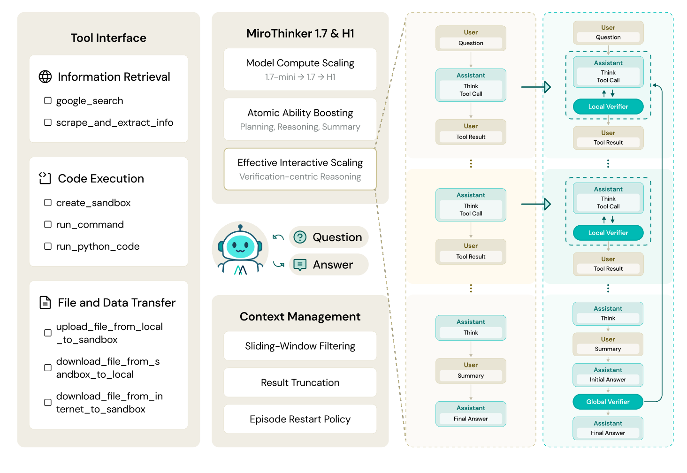
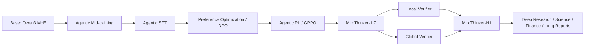
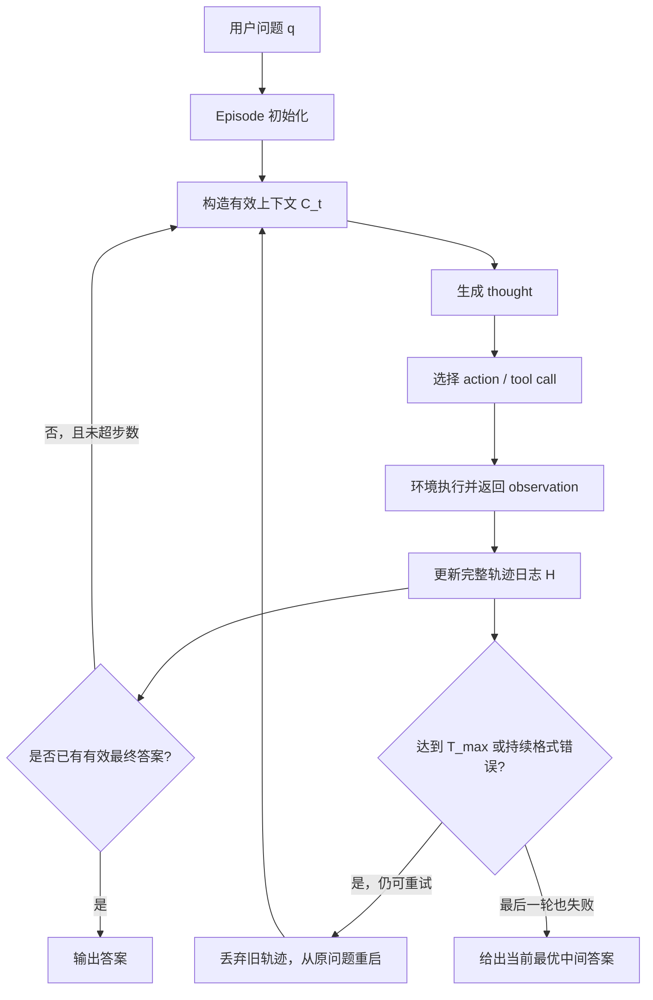
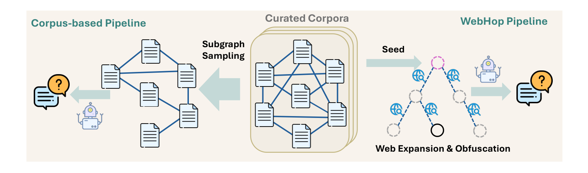
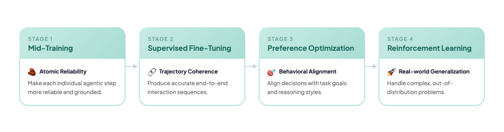
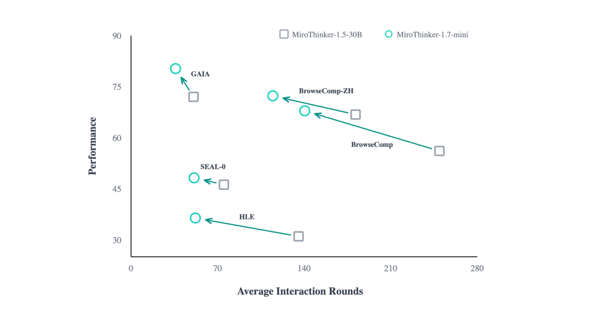
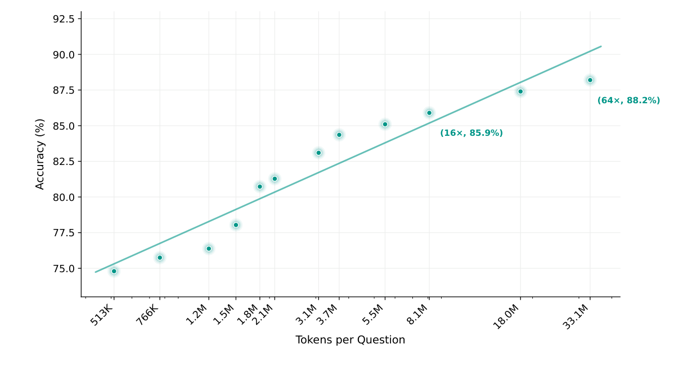

# MiroThinker-1.7 & H1 学习笔记

> 来源：`D:\Users\文献\MiroThinker-1.7&H1-TowardsHeavy-Duty.pdf`
> 论文：MiroThinker-1.7 & H1: Towards Heavy-Duty Research Agents via Verification
> 重点：深度研究 Agent、agentic mid-training、有效交互扩展、局部/全局验证、长程推理评测

## 1. 一句话概括

MiroThinker-1.7 通过强化每一步的规划、推理、工具调用和总结能力来提升深度研究 Agent 的“有效交互”，MiroThinker-H1 在此基础上加入局部验证和全局验证，使长程检索推理不只是“多走几步”，而是能持续审查、修正和选择证据链。

## 2. 核心结论

- 作者认为长程 Agent 的瓶颈不是交互轮数不够，而是每一步是否可靠；错误步骤越多，长轨迹越容易累积噪声。
- MiroThinker-1.7 的训练管线包含四阶段：Agentic Mid-training、Agentic SFT、DPO 偏好优化、在线 GRPO 强化学习。
- Agentic Mid-training 专门训练单步原子能力：冷启动规划、上下文条件推理、工具调用、阶段性总结。
- H1 的核心增量是 verification-centric reasoning：Local Verifier 审查步骤级决策，Global Verifier 审查完整证据链。
- H1 在 BrowseComp、BrowseComp-ZH、GAIA、SEAL-0、FrontierSci-Olympiad、FinSearchComp 等基准上达到很强结果。
- 实验支持“有效交互扩展”：MiroThinker-1.7-mini 相比 MiroThinker-1.5-30B 平均性能提升 16.7%，交互轮数减少约 43.0%。

## 3. 论文结构速览

| 部分 | 页码 | 要点 |
|---|---:|---|
| Abstract / Introduction | 1-3 | 提出有效交互扩展、MiroThinker-1.7 和 H1 |
| Related Works | 3 | Agentic LLM、Deep Research Agent |
| Agentic Workflow | 3-6 | ReAct 式双循环、滑动窗口上下文、工具接口、重启策略 |
| High-Quality QA Construction | 7-8 | Corpus-based 与 WebHop 双管线合成训练题 |
| Training Pipeline | 9-13 | Mid-training、SFT、DPO、GRPO 与关键目标函数 |
| Heavy-duty Reasoning Mode | 13 | Local Verifier 与 Global Verifier |
| Experiments | 13-18 | Agentic、专业领域、长报告、交互扩展、验证消融 |
| Conclusions | 18 | 总结有效交互与验证驱动长程推理 |

## 4. 整体技术路线

论文的主线是：先让模型的每个 agentic step 更强，再用验证机制让长轨迹更可靠。MiroThinker-1.7 解决“每一步更会做事”，H1 解决“做完之后能审查和纠错”。

## 5. Agentic Workflow

这一节要回答的是：MiroThinker-1.7 不是一次性生成答案，而是如何像一个研究助理一样反复搜索、阅读、推理、调用工具、修正方向，直到形成答案。

论文里的 Agentic Workflow 可以理解为一个受控的 ReAct 工作流：

这里的关键不是“多调用几次搜索工具”这么简单，而是三件事的组合：

| 机制 | 解决的问题 | 直观理解 |
|---|---|---|
| Step Loop | 如何在一次尝试中逐步收集证据 | 每一步都经历“想一想 -> 做动作 -> 看反馈” |
| Context Management | 长轨迹如何不撑爆上下文 | 保留决策脉络，压缩或丢弃过旧的工具结果 |
| Episode Loop | 当前轨迹走坏时如何恢复 | 不在污染的上下文里硬撑，直接从原题重新开始 |

### 5.1 基本概念

先把论文中的几个对象对应到实际含义：

| 符号/概念 | 含义 | 在 Agent 中对应什么 |
|---|---|---|
| $q$ | 原始用户问题 | 研究任务或待回答问题 |
| episode | 一次完整尝试 | 从原问题出发的一条独立解题轨迹 |
| step | episode 内的一轮交互 | 一次 thought、action、observation |
| $T_i$ | Thought | 模型的中间推理、计划、假设或下一步意图 |
| $A_i$ | Action | 工具调用，例如搜索、抓网页、执行代码 |
| $O_i$ | Observation | 工具或环境返回的结果，例如网页摘要、命令输出 |
| $H_t^{(e)}$ | 原始轨迹日志 | 第 $e$ 次尝试到第 $t$ 步前的完整历史 |
| $C_t^{(e)}$ | 有效上下文 | 真正喂给模型看的、经过裁剪后的历史 |

Agentic Workflow 的一个容易混淆点是：系统会保存完整的轨迹日志 $H_t^{(e)}$，但模型每一步实际看到的是有效上下文 $C_t^{(e)}$。也就是说，日志层面“全量记录”，推理层面“预算内选择性暴露”。

### 5.2 ReAct 与 Step Loop

MiroThinker-1.7 基于 ReAct。ReAct 的意思是把 reasoning 和 acting 交替起来：模型不是直接给最终答案，而是先写出当前思考，再决定是否调用工具，之后根据工具反馈继续推理。

在第 $e$ 个 episode 的第 $t$ 步之前，轨迹日志为：

$$
H_t^{(e)}=\{(T_1,A_1,O_1),\ldots,(T_{t-1},A_{t-1},O_{t-1})\}
$$

其中：

- $T_i$：第 $i$ 步的 thought，即模型当时的推理或计划。
- $A_i$：第 $i$ 步的 action 或 tool call，即模型决定执行的外部动作。
- $O_i$：环境或工具返回的 observation，即模型执行动作后获得的新信息。

每一步先生成 thought，再选择 action：

$$
T_t=f_\theta(q,C_t^{(e)})
$$

$$
A_t=\pi_\theta(C_t^{(e)},T_t)
$$

环境执行动作并返回 observation：

$$
O_t=\mathrm{Tool}(A_t)
$$

然后把这一轮交互追加到原始轨迹日志：

$$
H_{t+1}^{(e)}=H_t^{(e)}\cup\{(T_t,A_t,O_t)\}
$$

这就是 Step Loop：只要没有得到有效最终答案，且还没有超过当前 episode 的步数预算，agent 就继续执行下一轮 thought/action/observation。

### 5.3 为什么需要上下文管理

长程研究任务的主要矛盾是：Agent 需要很多步骤才能找到证据，但模型上下文窗口是有限的。更麻烦的是，工具返回往往很长，例如网页正文、搜索结果、Python 输出、命令日志。如果把所有 observation 原样塞回上下文，很快就会出现两个问题：

- 上下文预算被工具输出消耗，模型没有足够空间继续推理。
- 旧网页和旧命令输出会制造噪声，干扰模型判断当前最该做什么。

论文的经验判断是：远处的 thought/action 仍然有用，因为它记录了“为什么走到现在”；但远处的 observation 边际收益较低，因为很多工具结果只对接下来几步最有用。因此 MiroThinker-1.7 保留完整 thought/action trace，只对 observation 做滑动窗口过滤和截断。

### 5.4 滑动窗口上下文管理

模型不直接读完整 $H_t^{(e)}$，而是通过上下文算子 $\Phi_t$ 构造有效上下文。滑动窗口索引为：

$$
S_t(K)=\{i\in\{1,\ldots,t-1\}\mid i\ge t-K\}
$$

$S_t(K)$ 表示最近 $K$ 步的索引集合。论文实验中 $K=5$，也就是默认只保留最近 5 个 observation 的内容。若 $t\le K$，说明轨迹还很短，此时所有已有 observation 都会被保留，只受单条输出长度 $L$ 的截断限制。

对 observation 的保留策略是：

$$
\Phi_t(O_i)=
\begin{cases}
\mathrm{Trunc}_L(O_i), & i\in S_t(K) \\
\emptyset, & \mathrm{otherwise}
\end{cases}
$$

其中：

- $K$：最近 observation 的窗口大小，论文实验中设为 $K=5$。
- $L$：单个工具输出的截断 token 上限。
- $\mathrm{Trunc}_L(O_i)$：把第 $i$ 步工具输出裁剪到最多 $L$ 个 token。
- $\emptyset$：窗口外 observation 被省略，不再占用当前上下文。

有效上下文为：

$$
C_t^{(e)}=\{(T_i,A_i,\Phi_t(O_i))\}_{i=1}^{t-1}
$$

这个式子有一个重要含义：$T_i$ 和 $A_i$ 始终保留，只有 $O_i$ 会被 $\Phi_t$ 处理。换成直观语言就是：

| 历史内容 | 是否长期保留 | 原因 |
|---|---|---|
| Thought | 保留 | 记录任务分解、假设变化和推理路径 |
| Action | 保留 | 记录已经搜索过什么、访问过什么、运行过什么 |
| Observation | 只保留最近窗口，且可截断 | 内容最长、噪声最大、对远期步骤的边际收益最低 |

如果某个工具输出被截断，系统会加上 `[Result truncated]` 标记。这个标记的作用不是直接补全信息，而是提醒模型：当前结果不完整，如果确实需要细节，应该发起更聚焦的后续查询或命令。

### 5.5 工具调用与环境执行

在这个工作流里，action 不是普通自然语言，而是可被框架执行的工具调用。论文把工具分成三类：

| 工具类别 | 典型动作 | Agent 获得什么能力 |
|---|---|---|
| Information Retrieval | `google_search`、`scrape_and_extract_info` | 搜索网页、抓取页面、提取任务相关证据 |
| Code Execution | `create_sandbox`、`run_command`、`run_python_code` | 在隔离环境中计算、处理文件、验证数据 |
| File/Data Transfer | upload/download 工具 | 在本地、sandbox、互联网之间移动数据 |

因此，$\mathrm{Tool}(A_t)$ 可以理解成“框架把模型输出的结构化动作交给外部环境执行”。执行结果返回为 $O_t$，再进入下一轮上下文。

长程 agent 的一个现实问题是：模型可能生成格式错误的 tool call，例如工具名幻觉、参数名写错、路由到错误 server。论文在框架层做拦截和自动修正，避免单次格式错误让整条长轨迹中断。这个机制属于工程鲁棒性，但对长任务很关键，因为步数越多，任意一步失败的累计概率越高。

### 5.6 Episode Loop 与 Restart

Step Loop 解决“一条轨迹里怎么往前走”，Episode Loop 解决“这条轨迹走坏了怎么办”。

第一个 episode 只用原问题初始化：

$$
C_0^{(1)}=\{q\}
$$

如果当前 episode 达到最大步数 $T_{\max}$ 仍没有有效答案，或持续出现最终答案格式错误，就进入新的 episode，并且只保留原问题：

$$
C_0^{(e)}=\{q\},\quad e>1
$$

这一步会丢弃上一条轨迹中的 thought、action、observation。它看起来浪费，但有两个好处：

- 防止 agent 被错误假设、过期证据或污染上下文继续带偏。
- 重新释放上下文预算，让下一次尝试不背负旧轨迹的 token 成本。

实验里大多数 benchmark 的 $T_{\max}=200$，BrowseComp、BrowseComp-ZH、DeepSearchQA 的 $T_{\max}=300$，最大重启次数 $R_{\max}=5$。

最后一个 episode 的策略也很重要：如果最后一轮再次达到 $T_{\max}$，agent 不再继续推迟回答，而是尝试输出答案；如果没有规范最终答案，就从轨迹里抽取当前最好的中间答案作为 fallback。这样评测和真实使用时不会静默失败。

### 5.7 这一节和后文训练/验证的关系

Agentic Workflow 是后文所有训练和验证机制的运行载体：

- 在 Agentic SFT 中，专家轨迹就是由 thought/action/observation triplets 组成的 $H$。
- 在 DPO 和 RL 中，偏好或奖励不是只看单句回答，而是作用在整条 agent trajectory 上。
- 在 H1 中，Local Verifier 插入 Step Loop，审查局部 planning、tool call、hypothesis update；Global Verifier 插入最终阶段，审查完整证据链和候选答案。

所以这一节不是单纯的推理时框架描述，而是在定义“什么叫一个可训练、可评测、可验证的 research agent 轨迹”。MiroThinker-1.7 主要强化这个轨迹中每一步的有效性；H1 则在同一轨迹结构上加入显式验证，让长链条不容易被早期错误拖偏。

## 6. 工具与实现细节

| 工具类别 | 工具 | 作用 |
|---|---|---|
| Information Retrieval | `google_search`, `scrape_and_extract_info` | 搜索、抓取网页、抽取任务相关证据 |
| Code Execution | `create_sandbox`, `run_command`, `run_python_code` | 在隔离 Linux sandbox 中执行命令和 Python |
| File/Data Transfer | upload/download 工具 | 在本地、sandbox、互联网之间传输文件 |

重要工程策略：

- `scrape_and_extract_info` 会用 fallback pipeline 获取网页，再用轻量模型压缩成任务相关证据。
- 长输出会被截断并附加 `[Result truncated]` 标记，提示模型可以发起更聚焦的后续查询。
- 框架层会拦截并修正 malformed tool calls，例如工具名幻觉、参数名错误、server routing 错误。
- 评测时主动屏蔽 HuggingFace 等可能泄露 benchmark 问题和答案的来源，降低数据污染。

## 7. 高质量 QA 构造

论文使用两条互补的数据合成管线：

| 管线 | 目标 | 特点 |
|---|---|---|
| Corpus-based Pipeline | 大规模、多主题、高吞吐 QA | 从 Wikipedia、OpenAlex 等强链接语料采样文档子图，生成多跳 QA |
| WebHop Pipeline | 更难、更接近真实开放网页任务 | 构建 reasoning tree，经网页扩展、实体混淆、层级验证后生成 QA |

### 7.1 Corpus-based Pipeline

该管线保留文档 hyperlink topology，从 seed document 采样 connected subgraph，再抽取跨文档事实并让强 LLM 合成多跳问题。优点是覆盖广、产量高，缺点是难度控制较隐式，可能存在 shortcut 或信息泄露。

### 7.2 WebHop Pipeline

WebHop 用三类机制弥补 Corpus-based 的不足：

| 机制 | 作用 |
|---|---|
| Structured Multi-hop Graphs | 以答案实体为 root 构建 directed reasoning tree，树深控制推理 hop |
| Web-based Semantic Expansion | 通过实时网页搜索扩展子节点，排除百科源以引入更真实的开放网页知识 |
| Hierarchical Solvability Verification | 每层验证“子节点是否足以缩小父节点候选范围”，root 必须可由一跳邻居唯一识别 |
| Adaptive Leaf Obfuscation | 把容易泄露答案的叶子实体替换成功能描述，若 LLM 可直接识别则重生成 |

难度过滤采用“能力不同的 search agents”做 post-hoc filtering：弱 agent 能解的题放到早期训练，强 agent 也难解的题保留给后期 RL，形成 curriculum。

## 8. 训练管线

### 8.1 Stage 1：Agentic Mid-training

Mid-training 目标是提升原子 agent 能力，而不是直接训练完整长轨迹。数据包括：

| 数据类型 | 训练能力 |
|---|---|
| Single-turn planning | 只给用户问题，生成结构化计划和第一个 tool call |
| Context-conditioned reasoning | 给定已有轨迹前缀，重写某一步的更优 reasoning 或 tool decision |
| Intermediate summarization | 在部分 observation 下聚合证据、形成中间总结 |

统一目标函数是：

$$
L_{\mathrm{mid}}(\theta)
=-\mathbb{E}_{(C_{<k},y_k)\sim D_{\mathrm{mid}}}
\left[\log \pi_\theta(y_k\mid C_{<k})\right]
$$

其中：

- $C_{<k}$：第 $k$ 步之前的上下文，包括任务指令、历史推理、tool calls、tool observations。
- $y_k$：目标 assistant output；当 $k=1$ 时是初始 plan 和 first tool call，当 $k>1$ 时是重写后的 reasoning 或 summary。

论文同时混入 general instruction-following 和 knowledge-intensive 数据，以缓解灾难性遗忘。

### 8.2 Stage 2：Agentic SFT

SFT 数据集为：

$$
D_{\mathrm{SFT}}=\{(x_i,H_i)\}_{i=1}^{N}
$$

其中每个 $H_i$ 是 thought-action-observation triplets：

$$
H_i=\{(T_{i,t},A_{i,t},O_{i,t})\}_{t=1}^{T_i}
$$

训练目标是最大化专家轨迹中的 thought 与 action：

$$
L_{\mathrm{SFT}}(\theta)
=-\mathbb{E}_{(x,H)}
\left[
\sum_{t=1}^{T_H}
\log \pi_\theta(T_t,A_t\mid x,H_{<t})
\right]
$$

这里工具不会在训练时真实执行，observation 已经预先收集好，并作为用户轮次的一部分提供给模型。

### 8.3 Stage 3：Agentic Preference Optimization

偏好数据集为：

$$
D_{\mathrm{PO}}=\{(x_i,H_i^+,H_i^-)\}_{i=1}^{M}
$$

偏好原则主要基于最终答案正确性，不强制固定规划长度、步数或模板，避免把表面结构误当作质量。DPO loss 为：

$$
L_{\mathrm{DPO}}(x,H^+,H^-)
=-\log \sigma
\left(
\beta
\left[
\left(\log\pi_\theta(H^+\mid x)-\log\pi_\theta(H^-\mid x)\right)
-
\left(\log\pi_{\mathrm{ref}}(H^+\mid x)-\log\pi_{\mathrm{ref}}(H^-\mid x)\right)
\right]
\right)
$$

总体目标加上 preferred trajectories 的 SFT loss：

$$
L_{\mathrm{PO}}(\theta)
=\mathbb{E}_{(x,H^+,H^-)}
\left[L_{\mathrm{DPO}}(x,H^+,H^-)\right]
+\lambda L_{\mathrm{SFT}}^{(+)}(\theta)
$$

其中 $\pi_{\mathrm{ref}}$ 是 frozen reference model，$\beta$ 控制偏离 reference 的程度，$\lambda$ 控制辅助 SFT loss 权重。

### 8.4 Stage 4：Agentic RL

RL 使用在线 GRPO，每个 batch 的 rollouts 只消费一次做 policy gradient。奖励函数为：

$$
R(x,H)=\alpha_c R_{\mathrm{correct}}(H)-\alpha_f R_{\mathrm{format}}(H)
$$

对同一 prompt 采样 $G$ 条轨迹，优势函数相对组均值计算：

$$
\hat{A}_i
=R(x,H_i)-\frac{1}{G}\sum_{j=1}^{G}R(x,H_j)
$$

最终目标为：

$$
L_{\mathrm{GRPO}}(\theta)
=\mathbb{E}_{x\sim D, H\sim\pi_\theta}
\left[
\hat{A}(x,H)\log\pi_\theta(H\mid x)
-
\sum_{t=1}^{|H|}
\beta_{\mathrm{KL}}(t,H)
D_{\mathrm{KL}}\left(\pi_\theta(\cdot\mid s_t)\|\pi_{\mathrm{ref}}(\cdot\mid s_t)\right)
\right]
$$

动态 KL 系数为：

$$
\beta_{\mathrm{KL}}(t,H)
=\beta_0+\beta_{\mathrm{ent}}\mathbf{1}
\left(\hat{A}(x,H)<0\ \land\ \log\pi_\theta(a_t\mid s_t)<\tau\right)
$$

含义是：对负向 rollouts 中低概率 token 加额外 KL 惩罚，防止模型过度压低这些 token 的概率导致 entropy collapse，从而维持探索。

## 9. Heavy-duty Reasoning Mode

H1 的核心是把显式验证插入长程推理。

| Verifier | 审查对象 | 作用 |
|---|---|---|
| Local Verifier | 当前 planning、tool call、hypothesis update 等中间决策 | 促使模型探索替代动作，避免只沿最高概率习惯路径前进 |
| Global Verifier | 完整证据链和候选解路径 | 如果证据不足，要求补全或重采样；最终选择证据最完整、最可靠的答案 |

论文的一个关键判断是：verification 往往比 generation 更容易。H1 利用这个 generation-verification asymmetry，让模型在有限 compute budget 下不急于提交答案，而是先让证据链经得起审查。

## 10. 实验结果

### 10.1 Agentic Benchmarks

| 模型 | BrowseComp | BrowseComp-ZH | HLE | GAIA | xbench-DeepSearch | SEAL-0 | DeepSearchQA |
|---|---:|---:|---:|---:|---:|---:|---:|
| MiroThinker-1.7-mini | 67.9 | 72.3 | 36.4 | 80.3 | 57.2 | 48.2 | 67.9 |
| MiroThinker-1.7 | 74.0 | 75.3 | 42.9 | 82.7 | 62.0 | 53.0 | 72.1 |
| MiroThinker-H1 | 88.2 | 84.4 | 47.7 | 88.5 | 72.0 | 61.3 | 80.6 |

关键对比：

- H1 在 BrowseComp 达到 88.2，BrowseComp-ZH 达到 84.4。
- H1 在 GAIA 达到 88.5，论文称超过 OpenAI-GPT-5 的 76.4，差距为 12.1 个百分点。
- xbench-DeepSearch 上 H1 为 72.0，接近 OpenAI-GPT-5 的 75.0。
- SEAL-0 上 H1 为 61.3，在表内模型中最高。

### 10.2 专业领域 Benchmarks

| 模型 | FrontierSci-Olympiad | SUPERChem text-only | FinSearchComp T2/T3 | MedBrowseComp |
|---|---:|---:|---:|---:|
| MiroThinker-1.7-mini | 67.9 | 36.8 | 62.6 | 48.2 |
| MiroThinker-1.7 | 71.5 | 42.1 | 67.9 | 54.2 |
| MiroThinker-H1 | 79.0 | 51.3 | 73.9 | 56.5 |

H1 在四个专业领域任务中的三个取得表内最高：FrontierSci-Olympiad、FinSearchComp、MedBrowseComp。SUPERChem 上 Gemini-3-Pro 的 63.2 更高。

### 10.3 长报告评测

DeepResearchEval 生成 50 个 deep research queries，评估 Report Quality 和 Factuality。

| 模型 | Report | Factuality | Overall |
|---|---:|---:|---:|
| ChatGPT-5.4 Deep Research | 76.4 | 85.5 | 81.0 |
| Gemini-3.1-Pro Deep Research | 72.3 | 73.3 | 72.8 |
| MiroThinker-1.7-mini | 75.4 | 78.4 | 76.9 |
| MiroThinker-1.7 | 76.5 | 78.5 | 77.5 |
| MiroThinker-H1 | 76.8 | 79.1 | 78.0 |

H1 的 Report Quality 在表中最高，但 Overall 仍低于 ChatGPT-5.4 Deep Research，主要差距来自 factuality。

### 10.4 有效交互扩展

在同样 30B 参数预算下，MiroThinker-1.7-mini 相比 MiroThinker-1.5-30B：

- 五个 agentic benchmark 平均性能提升 16.7%。
- 平均交互轮数减少约 43.0%。
- HLE 上提升尤其明显：性能提升 17.4%，交互轮数减少 61.6%。

这支持论文的核心观点：Agent 不能只靠更长轨迹解决问题，必须提高每个 step 的信息增益。

### 10.5 验证机制消融

| 模型 | BrowseComp hard subset Pass@1 | Steps |
|---|---:|---:|
| MiroThinker-1.7 | 32.1 | 1185.2 |
| MiroThinker-H1 w/ Local Verifier Only | 58.5 | 210.8 |

Local Verifier 在 295 个 hard subset 问题上带来 +26.4 Pass@1，同时把步骤数从 1185.2 降到 210.8，约为原来的六分之一。论文强调这不是直接优化目标，而是局部验证让每一步更有效的副产物。

Global Verifier 的增益在搜索密集任务上更明显：

- BrowseComp：相比 MiroThinker-1.7 提升 +14.2。
- SEAL-0：提升 +8.3。
- FrontierScience-Olympiad：提升 +7.5。
- HLE：提升 +4.8。
- BrowseComp 上 16x compute 达到 85.9%，64x compute 达到 88.2%。

## 11. 局限与阅读注意点

论文没有单独的 Limitations section，但从方法和实验可见几个需要注意的点：

- 评测强依赖 LLM-as-a-Judge，不同 benchmark 使用不同 judge 或官方协议，跨表横向比较要谨慎。
- 部分竞品分数来自技术报告或 model card，而不是完全统一复现实验。
- H1 的性能提升伴随更高推理 compute，尤其 Global Verifier 会通过多候选证据链选择答案。
- Web 检索类 benchmark 受搜索后端、网页可访问性、网页时间变化影响；论文有污染屏蔽，但无法完全消除开放网页环境的不稳定性。
- 论文强调“verification easier than generation”，但 verifier 本身也可能受模型偏见、证据抽取错误或 judge 错误影响。

## 12. 个人学习笔记

这篇报告的核心不是提出一个新的 Agent 框架 API，而是把深度研究 Agent 的训练和推理拆成两层问题：第一层是 step-level atomic reliability，第二层是 trajectory-level verification。前者通过训练让每一步更像“有用动作”，后者通过验证让长链条不被早期错误拖垮。

最值得借鉴的是 context management 的取舍：完整保留 thought/action trace，只对 observation 做滑动窗口与截断。这比粗暴压缩全部历史更合理，因为 Agent 的决策意图和动作路径很短，但网页、命令、文档输出常常很长。

H1 的 Local Verifier 结果也很有启发：它不仅提升准确率，还大幅减少步骤数。这说明好的验证不一定只增加成本，也可能通过及时纠错减少无效探索。真正的 tradeoff 在 Global Verifier：更可靠，但需要更多候选轨迹和 evidence auditing。

## 13. 复习清单

- [ ] 为什么论文说应该扩展 effective interaction，而不是只增加 interaction length？
- [ ] MiroThinker-1.7 的 Step Loop 和 Episode Loop 分别解决什么问题？
- [ ] 为什么只对 observation 做 sliding-window filtering，而不是删除 thought/action trace？
- [ ] Corpus-based Pipeline 和 WebHop Pipeline 分别贡献什么训练信号？
- [ ] Agentic Mid-training 为什么只监督单步 target assistant turn？
- [ ] SFT、DPO、GRPO 在四阶段训练管线中分别负责什么？
- [ ] DPO 偏好排序为什么主要基于答案正确性，而不是固定步数或模板？
- [ ] Targeted entropy control 解决 RL 中的什么稳定性问题？
- [ ] Local Verifier 和 Global Verifier 的审查粒度有什么区别？
- [ ] Table 4 中 Local Verifier 为什么能同时提升 Pass@1 和减少 Steps？

## 14. 术语表

| 术语 | 含义 |
|---|---|
| Deep Research Agent | 面向开放网页检索、长程推理和证据综合的 Agent |
| ReAct | 交替生成 reasoning 与 action/tool call 的 Agent 范式 |
| Effective Interaction Scaling | 提升每一步交互的信息增益，而不是单纯延长轨迹 |
| Agentic Mid-training | 面向规划、推理、工具使用、总结等原子 Agent 能力的中训练 |
| WebHop | 通过网页扩展、多跳图、实体混淆和层级验证构造困难 QA 的管线 |
| DPO | Direct Preference Optimization，直接偏好优化 |
| GRPO | Group Relative Policy Optimization，基于组内相对优势的 RL 方法 |
| Local Verifier | 审查中间决策和局部动作的验证器 |
| Global Verifier | 审查完整证据链和候选解路径的验证器 |
| avg@k | 对同一问题运行 $k$ 次独立试验并报告平均分 |
